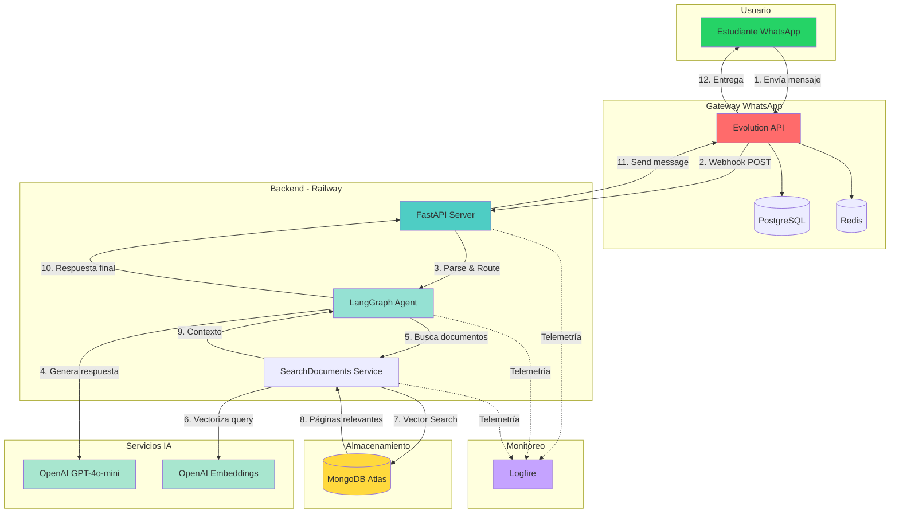

# 1. Arquitectura General del Sistema

## Descripción General

**ScienceBot** es un sistema de asistencia virtual inteligente para la Universidad Nacional de Piura (UNP) que opera a través de WhatsApp. Utiliza inteligencia artificial para responder automáticamente consultas de estudiantes sobre información académica, reglamentos, procedimientos y recursos universitarios.

## Objetivo del Sistema

Proporcionar respuestas **rápidas, precisas y contextualizadas** a estudiantes de la UNP mediante:

- Búsqueda inteligente en documentos académicos oficiales
- Comprensión del contexto de la consulta
- Generación de respuestas naturales y conversacionales
- Disponibilidad 24/7 via WhatsApp

## Stack Tecnológico

### Backend y Framework
- **FastAPI**: Framework web moderno para Python
- **LangGraph**: Orquestación de agentes conversacionales con grafos
- **LangChain**: Integración con modelos de lenguaje

### Inteligencia Artificial
- **OpenAI GPT-4o-mini**: Generación de respuestas conversacionales
- **OpenAI Embeddings (text-embedding-3-small)**: Vectorización de textos para búsqueda semántica

### Bases de Datos
- **MongoDB Atlas**: Almacenamiento de documentos con búsqueda vectorial
- **PostgreSQL**: Base de datos relacional para Evolution API
- **Redis**: Cache en memoria para Evolution API

### Integración WhatsApp
- **Evolution API**: Gateway para envío/recepción de mensajes en WhatsApp

### Deployment y Monitoreo
- **Railway**: Plataforma de hosting y deployment continuo
- **Logfire**: Observabilidad y monitoreo de aplicación

---

## Arquitectura de Alto Nivel



---

## Flujo de Datos Simplificado

### 1. Recepción del Mensaje

```
Usuario escribe en WhatsApp
    ↓
Evolution API recibe el mensaje
    ↓
Evolution API envía webhook a FastAPI
    ↓
FastAPI parsea y valida el mensaje
```

### 2. Procesamiento Inteligente

```
LangGraph Agent recibe el mensaje
    ↓
OpenAI GPT-4 decide si necesita buscar información
    ↓
Si necesita buscar → Llama a la herramienta search_documents
    ↓
SearchDocumentsService ejecuta pipeline de búsqueda
```

### 3. Búsqueda Semántica

```
Query del usuario → OpenAI Embeddings → Vector [1536 dimensiones]
    ↓
MongoDB Vector Search compara con documentos almacenados
    ↓
Retorna las páginas más relevantes con score de similitud
    ↓
OpenAI GPT-4 genera respuesta basada en el contexto encontrado
```

### 4. Respuesta al Usuario

```
LangGraph Agent finaliza el grafo
    ↓
FastAPI envía respuesta a Evolution API
    ↓
Evolution API entrega mensaje a WhatsApp
    ↓
Usuario recibe la respuesta
```

---

## Casos de Uso Principales

### 1. Consulta sobre Costos de Matrícula

**Usuario**: "¿Cuánto cuesta la matrícula en Ingeniería Informática?"

**Flujo**:
1. LangGraph detecta que necesita información específica
2. Llama a `search_documents` con school="Ingeniería Informática"
3. MongoDB busca en documentos de esa escuela + Información General
4. IA selecciona el documento más relevante (ej: "Reglamento de Pagos")
5. Busca páginas específicas sobre costos
6. Genera respuesta con el monto exacto y fuente

### 2. Consulta sobre Procedimientos

**Usuario**: "¿Cómo solicito una constancia de estudios?"

**Flujo**:
1. Sistema busca en documentos de "Información General"
2. Encuentra procedimiento en "Guía de Trámites"
3. Retorna pasos detallados con requisitos

### 3. Consulta General

**Usuario**: "Hola, ¿qué puedes hacer?"

**Flujo**:
1. LangGraph decide que no necesita buscar documentos
2. Responde directamente con capacidades del bot
3. No se ejecuta búsqueda en MongoDB

---

## Componentes Clave del Sistema

### 1. Evolution API Service ([EvolutionAPIService](../app/services/evolution_service.py))

- Envío de mensajes de texto
- Envío de presencia (typing indicator)
- Marcado de mensajes como leídos
- Parsing de webhooks entrantes

### 2. LangGraph Agent ([graph.py](../app/science_bot/agent/graph.py))

- Nodo `chat`: Invoca OpenAI GPT-4 con tools
- Nodo `tools`: Ejecuta herramientas (search_documents)
- Conditional edge: Decide si continuar o finalizar

### 3. SearchDocuments Service ([service.py](../app/science_bot/agent/tools/search_documents/service.py))

**Pipeline de 4 pasos**:
1. Obtener documentos relevantes de la escuela
2. Seleccionar mejor documento con IA
3. Buscar páginas específicas con Vector Search
4. Generar respuesta final con contexto

### 4. MongoDB Service ([mongo_db.py](../app/core/mongo_db.py))

- Conexión asíncrona a MongoDB Atlas
- Generación de embeddings
- Vector Search con `$vectorSearch`
- Gestión de colecciones Documents y Pages

---

## Características Técnicas

### Asincronía y Performance

- **Todo el stack es asíncrono**: FastAPI, Motor (MongoDB), httpx
- Operaciones concurrentes para mejor rendimiento
- Timeout de 2 minutos por operación

### Seguridad

- API keys en variables de entorno
- SecretStr para secrets sensibles
- Validación de webhooks de Evolution API
- Sin almacenamiento de datos personales

### Escalabilidad

- **Stateless**: Cada request es independiente
- MongoDB Atlas con autoscaling
- Railway con escalamiento horizontal
- Redis para cache distribuido

### Observabilidad

- **Logfire** para telemetría completa
- Instrumentación automática de:
  - FastAPI (requests, responses, errores)
  - HTTPX (llamadas HTTP)
  - OpenAI (prompts, tokens, latencia)

---

## Limitaciones Actuales

1. **Sin memoria conversacional persistente**: Cada mensaje se procesa de forma independiente
2. **Solo texto**: No maneja imágenes, audios o documentos adjuntos
3. **Un mensaje a la vez**: No procesa mensajes concurrentes del mismo usuario
4. **Idioma**: Configurado principalmente para español

---

## Tecnologías Explicadas

Cada tecnología se explica en detalle en los siguientes capítulos:

- **[Evolution API](./2-componentes/2.1-evolution-api.md)**: Gateway de WhatsApp
- **[PostgreSQL](./2-componentes/2.2-postgresql.md)**: Base de datos de Evolution
- **[Redis](./2-componentes/2.3-redis.md)**: Cache para Evolution
- **[FastAPI](./2-componentes/2.4-fastapi.md)**: Framework web
- **[LangGraph](./2-componentes/2.5-langgraph.md)**: Orquestación de agentes
- **[MongoDB Atlas](./2-componentes/2.6-mongodb-atlas.md)**: Base de datos con Vector Search
- **[Railway](./2-componentes/2.7-railway.md)**: Platform-as-a-Service

---

## Próximos Pasos

Para entender el sistema en profundidad:

1. **[Componentes](./2-componentes/)**: Aprende sobre cada tecnología
2. **[Flujo de Datos](./3-flujo-de-datos/)**: Sigue el recorrido de un mensaje
3. **[Modelo del Agente](./5-modelo-agente/)**: Entiende cómo funciona la IA
4. **[Diagramas](./8-diagramas/)**: Visualiza la arquitectura completa

---

**Volver al índice**: [README](./README.md)
