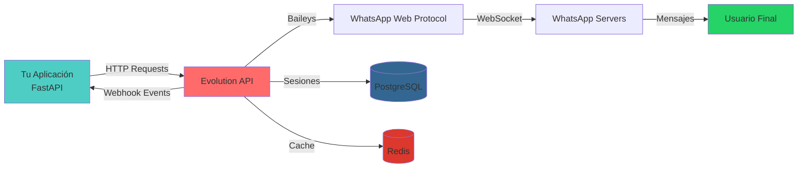

# 2.1 Evolution API

## ¿Qué es Evolution API?

**Evolution API** es una **API REST de código abierto** que actúa como gateway para conectar aplicaciones con **WhatsApp** sin necesidad de usar la API oficial de WhatsApp Business (que es costosa y tiene limitaciones).

### Características Principales

- **Multi-instancia**: Puede manejar múltiples números de WhatsApp simultáneamente
- **Webhooks**: Notifica eventos en tiempo real (mensajes, conexiones, etc.)
- **Sin restricciones**: No tiene límites de mensajes como la API oficial
- **Baileys bajo el capó**: Usa la librería Baileys para comunicarse con WhatsApp Web

## ¿Por qué se usa Evolution API?

| Aspecto | Evolution API | WhatsApp Business API Oficial |
|---------|---------------|-------------------------------|
| **Costo** | Gratuito (open source) | $0.005-0.009 por mensaje |
| **Setup** | Rápido (Docker) | Complejo (verificación de negocio) |
| **Límites** | Sin límites | Límites estrictos |
| **Verificación** | No requiere | Requiere verificación de Meta |
| **Flexibilidad** | Total control | Restricciones de Meta |

---

## Arquitectura de Evolution API



### ¿Por qué PostgreSQL?

Evolution API usa **PostgreSQL** para almacenar:

- **Sesiones de WhatsApp**: Credenciales de autenticación (QR Code scan)
- **Instancias**: Configuración de cada número conectado
- **Mensajes**: Historial de mensajes enviados/recibidos
- **Webhooks**: URLs y configuraciones de webhooks
- **Contactos**: Lista de contactos de cada instancia

### ¿Por qué Redis?

Evolution API usa **Redis** para:

- **Cache de sesiones activas**: Acceso rápido a sesiones en memoria
- **Cola de mensajes**: Mensajes pendientes de envío
- **Rate limiting**: Control de límites de envío
- **Estado temporal**: Estado de conexión en tiempo real
- **Performance**: Reducir queries a PostgreSQL

---

## Endpoints Principales Usados

### 1. Enviar Mensaje de Texto

```http
POST /message/sendText/{instance_name}
Content-Type: application/json
apikey: your_api_key

{
  "number": "51999999999",
  "text": "Hola, esta es la respuesta del bot"
}
```

**Implementación en el proyecto**:

```python
# app/services/evolution_service.py

async def send_message(
    self, phone_number: str, message: str, instance_name: str
) -> SendMessageResponse:
    url: str = f"{self.base_url}/message/sendText/{instance_name}"
    payload: dict[str, str] = {
        "number": self._format_phone_number(phone_number=phone_number),
        "text": message,
    }

    async with httpx.AsyncClient() as client:
        response: httpx.Response = await client.post(
            url=url, json=payload, headers=self._get_headers()
        )
        response.raise_for_status()
        return SendMessageResponse(error=False, message="Message sent successfully")
```

### 2. Enviar Presencia (Typing Indicator)

```http
POST /chat/sendPresence/{instance_name}
Content-Type: application/json
apikey: your_api_key

{
  "number": "51999999999",
  "presence": "composing",
  "delay": 3000
}
```

**Estados de presencia**:
- `composing`: "Escribiendo..." (typing)
- `recording`: "Grabando audio..."
- `available`: Online
- `unavailable`: Offline

**Implementación**:

```python
# app/services/evolution_service.py

async def send_presence(
    self,
    phone_number: str,
    instance_name: str,
    state: str = "composing",
    delay: int = 3000,
) -> PresenceResponse:
    """Muestra 'escribiendo...' en WhatsApp por 3 segundos"""
    url: str = f"{self.base_url}/chat/sendPresence/{instance_name}"

    payload: dict[str, str | int] = {
        "number": self._format_phone_number(phone_number=phone_number),
        "presence": state,
        "delay": delay,
    }

    async with httpx.AsyncClient() as client:
        response: httpx.Response = await client.post(
            url=url, json=payload, headers=self._get_headers()
        )
        response.raise_for_status()
        return PresenceResponse(error=False, message="Presence sent successfully")
```

### 3. Marcar Mensaje como Leído

```http
POST /chat/markMessageAsRead/{instance_name}
Content-Type: application/json
apikey: your_api_key

{
  "readMessages": [
    {
      "remoteJid": "51999999999@s.whatsapp.net",
      "id": "3EB0123456789ABCDEF",
      "fromMe": false
    }
  ]
}
```

**Implementación**:

```python
# app/services/evolution_service.py

async def mark_message_as_read(
    self, phone_number: str, instance_name: str, message_id: str
) -> ReadMessageResponse:
    """Marca el mensaje con doble check azul"""
    url: str = f"{self.base_url}/chat/markMessageAsRead/{instance_name}"

    formatted_number = self._format_phone_number(phone_number=phone_number)
    remote_jid = f"{formatted_number}@s.whatsapp.net"  # Formato WhatsApp

    payload: dict[str, list[dict[str, str | bool]]] = {
        "readMessages": [
            {
                "remoteJid": remote_jid,
                "id": message_id,
                "fromMe": False,  # Mensaje del usuario, no nuestro
            }
        ]
    }

    async with httpx.AsyncClient() as client:
        response: httpx.Response = await client.post(
            url=url, json=payload, headers=self._get_headers()
        )
        response.raise_for_status()
        return ReadMessageResponse(error=False, message="Message marked as read")
```

---

## Webhooks de Evolution API

Evolution API envía **webhooks** (POST requests) a tu servidor cuando ocurren eventos.

### Estructura del Webhook

```json
{
  "event": "messages.upsert",
  "instance": "sciencebot-production",
  "data": [
    {
      "key": {
        "remoteJid": "51999999999@s.whatsapp.net",
        "fromMe": false,
        "id": "3EB0123456789ABCDEF"
      },
      "pushName": "Juan Pérez",
      "messageTimestamp": 1698765432,
      "message": {
        "conversation": "¿Cuánto cuesta la matrícula?"
      }
    }
  ]
}
```

### Eventos Principales

| Evento | Descripción |
|--------|-------------|
| `messages.upsert` | Mensaje nuevo recibido |
| `messages.update` | Mensaje actualizado (leído, entregado) |
| `connection.update` | Estado de conexión cambió |
| `qr.updated` | QR Code actualizado |

### Parsing del Webhook

```python
# app/services/evolution_service.py

def parse_webhook_message(
    self, webhook_payload: WebhookPayload
) -> ParsedMessage | None:
    """Parse incoming webhook message from Evolution API."""
    try:
        # Filtrar solo mensajes nuevos
        if webhook_payload.event not in ["messages.upsert", "MESSAGES_UPSERT"]:
            return None

        message_data: MessageData = webhook_payload.data[0]

        # Ignorar mensajes propios
        if message_data.key.fromMe:
            return None

        # Extraer texto del mensaje
        text: str = (
            message_data.message.conversation
            or (
                message_data.message.extendedTextMessage
                and message_data.message.extendedTextMessage.text
            )
            or ""
        )

        if not text:
            return None

        return ParsedMessage(
            phone_number=message_data.key.remoteJid.replace("@s.whatsapp.net", ""),
            text=text,
            from_me=message_data.key.fromMe,
            message_id=message_data.key.id,
            push_name=message_data.pushName,
            timestamp=message_data.messageTimestamp,
        )

    except Exception:
        return None
```

---

## Configuración de Evolution API

### Variables de Entorno Necesarias

```bash
# En .env
EVOLUTION_API_URL=https://evolution-api-production-be18.up.railway.app
EVOLUTION_API_KEY=tu_api_key_secreta
```

### Configuración en el Proyecto

```python
# app/core/config.py

class Settings(BaseSettings):
    # Evolution API Configuration
    EVOLUTION_API_URL: str = Field(default="http://localhost:8080")
    EVOLUTION_API_KEY: str = Field(default="mi_api_key_evolution")
```

### Headers de Autenticación

```python
# app/services/evolution_service.py

def _get_headers(self) -> dict[str, str]:
    """Get headers for Evolution API requests."""
    return {
        "apikey": self.api_key,  # API Key en header
        "Content-Type": "application/json",
    }
```

---

## Formato de Números de Teléfono

WhatsApp usa el formato **internacional sin símbolos**:

```python
def _format_phone_number(self, phone_number: str) -> str:
    """Format phone number for WhatsApp (remove non-digits)."""
    return re.sub(pattern=r"[^\d]", repl="", string=phone_number)
```

**Ejemplos**:
- ❌ `+51 999 999 999` → ✅ `51999999999`
- ❌ `(999) 999-999` → ✅ `999999999`

**Formato WhatsApp JID**:
- Usuario: `51999999999@s.whatsapp.net`
- Grupo: `51999999999-1234567890@g.us`

---

## Ventajas de Evolution API en este Proyecto

1. **Costo cero**: No se paga por mensajes
2. **Setup rápido**: Docker en Railway en minutos
3. **Webhooks en tiempo real**: Respuestas inmediatas
4. **Múltiples instancias**: Escalar a más números fácilmente
5. **Control total**: Sin restricciones de Meta/WhatsApp
6. **PostgreSQL + Redis**: Persistencia y performance incluidos

---

## Limitaciones y Consideraciones

### ⚠️ Limitaciones

1. **No es oficial**: Meta puede banear números si detecta automatización
2. **Dependencia de Baileys**: Cambios en WhatsApp Web pueden romper la API
3. **Requiere QR Code**: Cada instancia necesita escanear QR para conectar
4. **Sin verificación**: No tiene el check verde de "Cuenta Verificada"

### ✅ Buenas Prácticas

1. **No spam**: Respetar límites de mensajes por segundo
2. **Números de prueba**: Usar números dedicados, no personales
3. **Monitoreo**: Vigilar estado de conexión constantemente
4. **Backup de sesión**: Guardar sesión en PostgreSQL para recuperación

---

## Recursos Adicionales

- [Evolution API Documentation](https://doc.evolution-api.com/)
- [Evolution API GitHub](https://github.com/EvolutionAPI/evolution-api)
- [Baileys Library](https://github.com/WhiskeySockets/Baileys)

---

## Próximos Pasos

- **[2.2 PostgreSQL](./2.2-postgresql.md)**: Base de datos de Evolution API
- **[2.3 Redis](./2.3-redis.md)**: Cache para Evolution API
- **[4.2 Integración Evolution](../4-servicios-externos/4.2-evolution-integracion.md)**: Detalles técnicos avanzados

**Volver al índice**: [README](../README.md)
