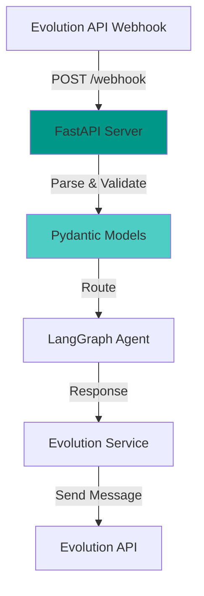

# 2.4 FastAPI

## ¿Qué es FastAPI?

**FastAPI** es un **framework web moderno** para Python, diseñado para construir APIs REST de alto rendimiento con validación automática de datos.

### Características Principales

- **Rápido**: Comparable a NodeJS y Go (basado en Starlette)
- **Type hints**: Validación automática con Pydantic
- **Async nativo**: Soporta `async/await` de Python
- **Documentación automática**: OpenAPI (Swagger) incluido
- **Developer-friendly**: Autocompletado y detección de errores

---

## ¿Por qué FastAPI para este Proyecto?



### Ventajas en este Contexto

1. **Webhooks**: Recibir eventos de Evolution API
2. **Async**: Procesamiento no bloqueante (importante para IA)
3. **Validation**: Asegurar estructura correcta de webhooks
4. **Type safety**: Menos errores en producción
5. **Performance**: Manejar múltiples usuarios concurrentes

---

## Estructura del Proyecto FastAPI

```
app/
├── main.py                    # Punto de entrada
├── lifespan.py               # Lifecycle management
├── router.py                 # Router principal
├── routes/
│   ├── health.py            # Health check endpoint
│   └── webhook.py           # Webhook de Evolution API
├── services/
│   └── evolution_service.py # Cliente de Evolution API
├── core/
│   ├── config.py            # Configuración (Settings)
│   └── mongo_db.py          # Cliente MongoDB
└── science_bot/
    └── agent/
        └── graph.py         # LangGraph Agent
```

---

## main.py - Aplicación Principal

```python
# app/main.py

import logfire
from fastapi import FastAPI
from fastapi.responses import HTMLResponse
from scalar_fastapi import get_scalar_api_reference

from app.core.config import Environment, settings
from app.lifespan import lifespan
from app.router import router as api_router

# Crear aplicación FastAPI
app = FastAPI(
    lifespan=lifespan,           # ⭐ Gestión de lifecycle
    docs_url=None,                # Deshabilitar /docs por defecto
    redoc_url=None,               # Deshabilitar /redoc
    title=settings.APP_NAME,      # "ScienceBot WhatsApp API"
    version=settings.APP_VERSION, # "1.0.0"
)

# Incluir router principal
app.include_router(router=api_router)

# Documentación en desarrollo (Scalar)
if settings.ENVIRONMENT == Environment.DEV:
    @app.get(path="/docs", include_in_schema=False)
    async def scalar_api_reference() -> HTMLResponse:
        return get_scalar_api_reference(
            openapi_url=app.openapi_url,
            title=app.title,
        )

# Observabilidad con Logfire
if settings.LOGFIRE_TOKEN:
    logfire.configure(
        service_name=settings.APP_NAME,
        environment=settings.ENVIRONMENT.value,
        token=settings.LOGFIRE_TOKEN,
    )

    logfire.instrument_fastapi(app)      # Instrumentar FastAPI
    logfire.instrument_httpx()           # Instrumentar HTTP calls
    logfire.instrument_openai()          # Instrumentar OpenAI
```

**Conceptos clave**:
- `lifespan`: Inicializa recursos al arrancar (ej: LangGraph)
- `router`: Organiza endpoints
- `Logfire`: Telemetría automática

---

## lifespan.py - Gestión de Recursos

```python
# app/lifespan.py

from contextlib import asynccontextmanager
from fastapi import FastAPI
from app.science_bot.agent.graph import get_graph

@asynccontextmanager
async def lifespan(app: FastAPI):
    # 🟢 STARTUP: Se ejecuta al iniciar el servidor
    print("[INFO] Initializing LangGraph agent...")
    graph = get_graph()
    app.state.science_bot_graph = graph  # Guardar en app.state
    print("[INFO] Agent ready!")

    yield  # ⏸️ Servidor corriendo aquí

    # 🔴 SHUTDOWN: Se ejecuta al cerrar el servidor
    print("[INFO] Cleaning up resources...")
    # Aquí podrías cerrar conexiones, etc.
```

**¿Por qué `lifespan`?**

- **Eficiencia**: Compilar el grafo una vez (no en cada request)
- **Compartir recursos**: `app.state` accesible en todas las rutas
- **Cleanup**: Cerrar conexiones al apagar

---

## router.py - Organización de Rutas

```python
# app/router.py

from fastapi import APIRouter
from app.routes.health import router as health_router
from app.routes.webhook import router as webhook_router

router = APIRouter()

router.include_router(router=health_router, tags=["health"])
router.include_router(router=webhook_router, tags=["webhook"])
```

**Endpoints del sistema**:

| Método | Ruta | Descripción |
|--------|------|-------------|
| GET | `/health` | Health check |
| POST | `/webhook` | Webhook de Evolution API |

---

## routes/health.py - Health Check

```python
# app/routes/health.py

from fastapi import APIRouter
from pydantic import BaseModel

router = APIRouter()

class HealthResponse(BaseModel):
    status: str
    service: str

@router.get("/health")
async def health_check() -> HealthResponse:
    """Endpoint para verificar que el servidor está vivo."""
    return HealthResponse(
        status="healthy",
        service="ScienceBot WhatsApp API"
    )
```

**Uso típico**: Railway/Docker lo llama cada 30s para verificar salud.

---

## routes/webhook.py - Webhook Principal

```python
# app/routes/webhook.py (simplificado)

from fastapi import APIRouter, Request
from app.models.webhook import WebhookPayload
from app.services.evolution_service import evolution_service

router = APIRouter()

@router.post("/webhook")
async def handle_webhook(
    webhook: WebhookPayload,  # ⭐ Validación automática con Pydantic
    request: Request
):
    """Recibe webhooks de Evolution API."""

    # 1. Parsear mensaje
    parsed = evolution_service.parse_webhook_message(webhook)

    if not parsed:
        return {"status": "ignored"}

    # 2. Obtener grafo de LangGraph
    graph = request.app.state.science_bot_graph

    # 3. Procesar con el agente
    response = await graph.ainvoke(
        input={"messages": [{"role": "user", "content": parsed.text}]},
        config={"phone_number": parsed.phone_number}
    )

    # 4. Enviar respuesta
    await evolution_service.send_message(
        phone_number=parsed.phone_number,
        message=response["messages"][-1].content,
        instance_name="sciencebot"
    )

    return {"status": "processed"}
```

**Flujo del webhook**:
1. Evolution API envía POST a `/webhook`
2. FastAPI valida con `WebhookPayload` (Pydantic)
3. Se parsea el mensaje
4. LangGraph procesa la consulta
5. Se envía respuesta via Evolution API

---

## Modelos Pydantic para Validación

```python
# app/models/webhook.py (simplificado)

from pydantic import BaseModel

class MessageKey(BaseModel):
    remoteJid: str          # "51999999999@s.whatsapp.net"
    fromMe: bool            # false
    id: str                 # "3EB0123456..."

class Message(BaseModel):
    conversation: str | None = None        # Mensaje de texto simple
    extendedTextMessage: dict | None = None # Mensaje con formato

class MessageData(BaseModel):
    key: MessageKey
    message: Message
    pushName: str                          # Nombre del contacto
    messageTimestamp: int                  # Unix timestamp

class WebhookPayload(BaseModel):
    event: str               # "messages.upsert"
    instance: str            # "sciencebot-production"
    data: list[MessageData]  # Array de mensajes

class ParsedMessage(BaseModel):
    phone_number: str        # "51999999999"
    text: str                # Texto del mensaje
    from_me: bool            # false
    message_id: str          # ID de WhatsApp
    push_name: str           # Nombre del usuario
    timestamp: int           # Unix timestamp
```

**Ventajas de Pydantic**:
- Validación automática de tipos
- Conversión de tipos (str → int, etc.)
- Documentación automática en OpenAPI
- Errores claros si la estructura es incorrecta

---

## Configuración con Pydantic Settings

```python
# app/core/config.py

from pydantic import Field
from pydantic_settings import BaseSettings

class Settings(BaseSettings):
    APP_NAME: str = Field(default="ScienceBot WhatsApp API")
    APP_VERSION: str = Field(default="1.0.0")

    # Evolution API
    EVOLUTION_API_URL: str = Field(default="http://localhost:8080")
    EVOLUTION_API_KEY: str = Field(default="mi_api_key_evolution")

    # OpenAI
    OPENAI_API_KEY: str = Field(default="")
    OPENAI_MODEL: str = Field(default="gpt-4o-mini")

    # MongoDB
    MONGO_URL: str = Field(default="mongodb://localhost:27017")

    model_config = {
        "env_file": ".env",          # Lee variables de .env
        "env_file_encoding": "utf-8",
        "case_sensitive": True,      # OPENAI_API_KEY (mayúsculas)
        "extra": "ignore",           # Ignorar variables extra
        "frozen": True,              # Inmutable (no se puede modificar)
    }

settings = Settings()  # ⭐ Instancia global
```

**Uso**:
```python
from app.core.config import settings

print(settings.OPENAI_API_KEY)  # Lee de .env automáticamente
```

---

## Async/Await en FastAPI

**Todas las operaciones son asíncronas**:

```python
# ✅ Async (no bloquea otros requests)
@router.post("/webhook")
async def handle_webhook(webhook: WebhookPayload):
    response = await openai_call()      # Async
    await mongo_service.save()          # Async
    await evolution_service.send()      # Async
    return response

# ❌ Sync (bloquearía el servidor)
@router.post("/webhook")
def handle_webhook(webhook: WebhookPayload):
    response = openai_call()            # Sync (bloquea!)
    return response
```

**Ventaja**: El servidor puede manejar múltiples usuarios simultáneamente mientras espera respuestas de OpenAI/MongoDB.

---

## Manejo de Errores

```python
from fastapi import HTTPException

@router.post("/webhook")
async def handle_webhook(webhook: WebhookPayload):
    try:
        # Procesar mensaje
        pass
    except ValueError as e:
        raise HTTPException(status_code=400, detail=str(e))
    except Exception as e:
        raise HTTPException(status_code=500, detail="Internal error")
```

**FastAPI automáticamente convierte a JSON**:
```json
{
  "detail": "Internal error"
}
```

---

## Dependency Injection

FastAPI permite inyectar dependencias:

```python
from fastapi import Depends

def get_evolution_service():
    return EvolutionAPIService()

@router.post("/webhook")
async def handle_webhook(
    webhook: WebhookPayload,
    service: EvolutionAPIService = Depends(get_evolution_service)
):
    await service.send_message(...)
```

**Ventaja**: Fácil de testear (mockear dependencias).

---

## Documentación Automática

FastAPI genera **OpenAPI** automáticamente:

```
http://localhost:8000/docs  # Scalar UI
```

**Muestra**:
- Todos los endpoints
- Parámetros y tipos
- Modelos Pydantic
- Try it out (probar desde el navegador)

---

## FastAPI vs Otros Frameworks

| Framework | Velocidad | Async | Type Safety | Docs |
|-----------|-----------|-------|-------------|------|
| **FastAPI** | ⭐⭐⭐⭐⭐ | ✅ | ✅ | ✅ |
| Flask | ⭐⭐⭐ | ❌ (extensión) | ❌ | ❌ |
| Django | ⭐⭐ | ✅ (parcial) | ❌ | ❌ |
| Express.js | ⭐⭐⭐⭐ | ✅ | ❌ | ❌ |

**FastAPI es ideal para**:
- APIs modernas con async
- Integración con IA (OpenAI, LangChain)
- Validación estricta de datos
- Microservicios

---

## Performance

```
Requests por segundo (benchmark):
- FastAPI: ~60,000 req/s
- Flask: ~20,000 req/s
- Django: ~10,000 req/s
```

**Async permite**:
- Manejar muchos usuarios concurrentes
- No bloquear en llamadas a OpenAI/MongoDB
- Mejor uso de CPU

---

## Testing con FastAPI

```python
from fastapi.testclient import TestClient
from app.main import app

client = TestClient(app)

def test_health():
    response = client.get("/health")
    assert response.status_code == 200
    assert response.json() == {"status": "healthy"}

def test_webhook():
    payload = {
        "event": "messages.upsert",
        "instance": "test",
        "data": [...]
    }
    response = client.post("/webhook", json=payload)
    assert response.status_code == 200
```

---

## Recursos Adicionales

- [FastAPI Official Docs](https://fastapi.tiangolo.com/)
- [Pydantic Documentation](https://docs.pydantic.dev/)
- [FastAPI Tutorial](https://fastapi.tiangolo.com/tutorial/)

---

## Próximos Pasos

- **[2.5 LangGraph](./2.5-langgraph.md)**: Motor del agente conversacional
- **[3.1 Recepción de Mensaje](../3-flujo-de-datos/3.1-recepcion-mensaje.md)**: Flujo completo del webhook

**Volver al índice**: [README](../README.md)
