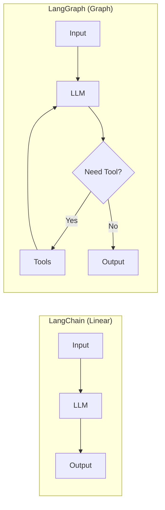
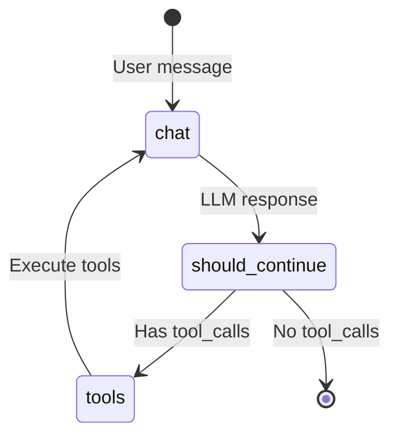
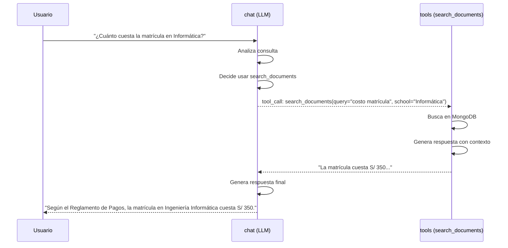

# 2.5 LangGraph

## ¿Qué es LangGraph?

**LangGraph** es un framework de **LangChain** para construir **agentes conversacionales** usando **grafos de estado**. Permite crear flujos complejos de IA con múltiples pasos, decisiones y herramientas.

### Diferencia con LangChain Simple

| Aspecto | LangChain | LangGraph |
|---------|-----------|-----------|
| **Estructura** | Cadenas lineales | Grafos con ciclos |
| **Complejidad** | Simple (A → B → C) | Compleja (A → B → A → C) |
| **Control** | Limitado | Total control del flujo |
| **Agentes** | Básicos | Avanzados con estado |
| **Uso típico** | RAG simple | Chatbots, multi-step reasoning |



---

## Conceptos Clave

### 1. **StateGraph** (Grafo de Estado)

Un grafo con **nodos** (funciones) y **edges** (transiciones):

```python
from langgraph.graph import StateGraph

# Definir el grafo
graph_builder = StateGraph(state_schema=OverallState)

# Agregar nodos
graph_builder.add_node(node="chat", action=chat_function)
graph_builder.add_node(node="tools", action=tool_function)

# Agregar edges (conexiones)
graph_builder.add_edge(start_key="tools", end_key="chat")

# Compilar
graph = graph_builder.compile()
```

### 2. **State** (Estado)

Diccionario compartido entre todos los nodos:

```python
from pydantic import BaseModel
from langchain_core.messages import BaseMessage

class OverallState(BaseModel):
    messages: list[BaseMessage]  # Lista de mensajes
    # Más campos si es necesario
```

### 3. **Nodes** (Nodos)

Funciones que procesan el estado:

```python
async def chat(state: InputState) -> dict:
    """Nodo que llama a OpenAI."""
    response = await llm.ainvoke(state.messages)
    return {"messages": [response]}
```

### 4. **Edges** (Aristas)

Conexiones entre nodos:

- **Edge fijo**: `add_edge("A", "B")` → Siempre va de A a B
- **Edge condicional**: `add_conditional_edges("A", function)` → Decide dinámicamente

---

## Arquitectura del Agente en el Proyecto



### Código Real del Grafo

```python
# app/science_bot/agent/graph.py

from langgraph.graph import StateGraph
from langgraph.prebuilt import ToolNode

# 1. Crear el grafo
graph_builder = StateGraph(
    state_schema=OverallState,     # Estado completo
    input_schema=InputState,       # Input del usuario
    output_schema=OutputState,     # Output final
    context_schema=Context,        # Contexto (phone_number, etc.)
)

# 2. Nodo: chat (LLM con tools)
async def chat(state: InputState, config: RunnableConfig) -> dict:
    context = Context.from_config(config)  # Obtener contexto

    # Modelo de OpenAI
    model = ChatOpenAI(
        model=settings.OPENAI_MODEL,       # gpt-4o-mini
        api_key=SecretStr(settings.OPENAI_API_KEY),
        max_completion_tokens=settings.OPENAI_MAX_TOKENS,
        temperature=settings.OPENAI_TEMPERATURE,
    )

    # Bind tools (search_documents)
    model_with_tools = model.bind_tools(tools=TOOLS, strict=True)

    # System prompt
    prompt = ChatPromptTemplate.from_messages([
        ("system", get_system_prompt(phone_number=context.phone_number)),
        MessagesPlaceholder(variable_name="messages"),
    ])

    # Invocar
    response = await (prompt | model_with_tools).ainvoke(
        input={"messages": state.messages}
    )

    return {"messages": [response]}


# 3. Nodo: tools (ejecutar herramientas)
graph_builder.add_node(node="tools", action=ToolNode(tools=TOOLS))


# 4. Conditional edge: ¿Tiene tool_calls?
async def should_continue(state: OverallState) -> Literal["tools", "__end__"]:
    last_message = state.messages[-1]
    if last_message.tool_calls:  # Si el LLM pidió usar una tool
        return "tools"
    return "__end__"  # Finalizar


# 5. Configurar grafo
graph_builder.add_node(node="chat", action=chat)
graph_builder.add_node(node="tools", action=ToolNode(tools=TOOLS))

graph_builder.set_entry_point("chat")  # Empezar en "chat"
graph_builder.add_conditional_edges(
    source="chat",
    path=should_continue,
    path_map=["tools", "__end__"]
)
graph_builder.add_edge(start_key="tools", end_key="chat")  # tools → chat

# 6. Compilar
def get_graph() -> Graph:
    return graph_builder.compile()
```

---

## Flujo de Ejecución

### Ejemplo: Usuario pregunta "¿Cuánto cuesta la matrícula en Informática?"



**Paso a paso**:

1. **Entrada**: `{"messages": [HumanMessage("¿Cuánto cuesta...")]}`
2. **Nodo chat**: LLM analiza y decide llamar `search_documents`
3. **should_continue**: Detecta `tool_calls` → retorna `"tools"`
4. **Nodo tools**: Ejecuta `search_documents`
5. **Edge tools → chat**: Vuelve a chat con resultado
6. **Nodo chat**: LLM genera respuesta final con contexto
7. **should_continue**: No hay más `tool_calls` → retorna `"__end__"`
8. **Salida**: `{"messages": [..., AIMessage("La matrícula cuesta...")]}`

---

## Estados (State)

### InputState

Lo que recibe el grafo del usuario:

```python
class InputState(BaseModel):
    messages: list[BaseMessage]  # [HumanMessage("Hola")]
```

### OverallState

Estado completo durante la ejecución:

```python
class OverallState(BaseModel):
    messages: list[BaseMessage]  # Historial completo de mensajes
```

### OutputState

Lo que retorna el grafo:

```python
class OutputState(BaseModel):
    messages: list[BaseMessage]  # [AIMessage("Respuesta")]
```

### Context

Información adicional (no modificable):

```python
class Context(BaseModel):
    phone_number: str  # Número de teléfono del usuario

    @classmethod
    def from_config(cls, config: RunnableConfig) -> "Context":
        return cls(phone_number=config.get("phone_number", "unknown"))
```

**Uso del contexto**:
```python
# Al invocar el grafo
response = await graph.ainvoke(
    input={"messages": [...]},
    config={"phone_number": "51999999999"}  # ⭐ Contexto
)
```

---

## Herramientas (Tools)

LangGraph puede llamar herramientas automáticamente:

```python
# app/science_bot/agent/tools/search_documents/tool.py

from langchain_core.tools import tool

@tool
async def search_documents(
    query: str,
    school: SchoolEnum,
) -> SearchDocumentsResponse:
    """
    Busca información en documentos académicos de la UNP.

    Args:
        query: Pregunta del usuario
        school: Escuela específica (ej: Ingeniería Informática)

    Returns:
        Respuesta generada con contexto de los documentos
    """
    async with SearchDocumentsService() as service:
        result = await service.search_and_answer(query=query, school=school.value)
        return SearchDocumentsResponse(success=result.success, message=result.message)

TOOLS = [search_documents]
```

**OpenAI automáticamente decide cuándo llamarla**:

```json
{
  "tool_calls": [
    {
      "name": "search_documents",
      "args": {
        "query": "costo de matrícula",
        "school": "INFORMATICA"
      }
    }
  ]
}
```

---

## Ventajas de LangGraph

### 1. **Control Total del Flujo**

```python
# Puedes hacer ciclos, condicionales complejos, etc.
graph_builder.add_conditional_edges(
    source="chat",
    path=lambda state: "redo" if state.needs_retry else "end"
)
```

### 2. **Estado Compartido**

Todos los nodos acceden al mismo estado:

```python
async def chat(state):
    print(state.messages)  # Historial completo

async def tools(state):
    print(state.messages)  # Mismo historial
```

### 3. **Debugging Fácil**

```python
# Ver cada paso del grafo
for event in graph.stream(input={"messages": [...]}):
    print(event)
```

### 4. **Visualización**

LangGraph tiene herramientas para visualizar el grafo:

```bash
uv run langgraph dev
# Abre UI en localhost:8123 con el grafo visual
```

---

## LangGraph vs LangChain vs Custom

| Aspecto | LangChain | LangGraph | Custom (sin framework) |
|---------|-----------|-----------|------------------------|
| **Complejidad** | Baja | Media | Alta |
| **Flexibilidad** | Limitada | Alta | Total |
| **Debugging** | Difícil | Fácil (UI) | Muy difícil |
| **Mantenimiento** | Fácil | Medio | Difícil |
| **Performance** | Buena | Buena | Excelente |
| **Mejor para** | RAG simple | Agentes | Sistemas muy específicos |

---

## Compilación del Grafo

```python
graph = graph_builder.compile()

# Invocar (async)
response = await graph.ainvoke(
    input={"messages": [HumanMessage(content="Hola")]},
    config={"phone_number": "51999999999"}
)

# Stream (ver pasos intermedios)
async for event in graph.astream(input={...}):
    print(event)
```

---

## Streaming de Respuestas

LangGraph soporta streaming para respuestas en tiempo real:

```python
async for chunk in graph.astream_events(input={...}):
    if chunk["event"] == "on_chat_model_stream":
        print(chunk["data"]["chunk"].content, end="")
```

**Útil para**:
- Mostrar "escribiendo..." en WhatsApp
- Respuestas progresivas en chat

---

## Persistencia de Estado

LangGraph puede guardar estado entre conversaciones:

```python
from langgraph.checkpoint.memory import MemorySaver

# Con memoria
memory = MemorySaver()
graph = graph_builder.compile(checkpointer=memory)

# Primera conversación
response1 = await graph.ainvoke(
    input={"messages": [HumanMessage("Hola")]},
    config={"configurable": {"thread_id": "user-123"}}
)

# Segunda conversación (recuerda la anterior)
response2 = await graph.ainvoke(
    input={"messages": [HumanMessage("¿Y el costo?")]},
    config={"configurable": {"thread_id": "user-123"}}
)
```

**Nota**: El proyecto actual **no usa persistencia** (cada mensaje es independiente).

---

## Limitaciones Actuales del Proyecto

1. **Sin memoria entre mensajes**: Cada consulta es independiente
2. **Un solo ciclo**: No hace múltiples iteraciones de herramientas
3. **Sin branching complejo**: Flujo lineal (chat → tools → chat → end)

---

## Mejoras Futuras

1. **Memoria conversacional**: Guardar historial en Redis/PostgreSQL
2. **Multi-tool**: Permitir llamar múltiples herramientas en secuencia
3. **Human-in-the-loop**: Pedir confirmación antes de ejecutar acciones
4. **Branching**: Diferentes flujos según el tipo de consulta

---

## Recursos Adicionales

- [LangGraph Documentation](https://langchain-ai.github.io/langgraph/)
- [LangGraph Tutorials](https://langchain-ai.github.io/langgraph/tutorials/)
- [LangGraph Studio](https://github.com/langchain-ai/langgraph-studio)

---

## Próximos Pasos

- **[2.6 MongoDB Atlas](./2.6-mongodb-atlas.md)**: Base de datos con Vector Search
- **[5.1 Estructura del Grafo](../5-modelo-agente/5.1-estructura-grafo.md)**: Análisis profundo del grafo

**Volver al índice**: [README](../README.md)
