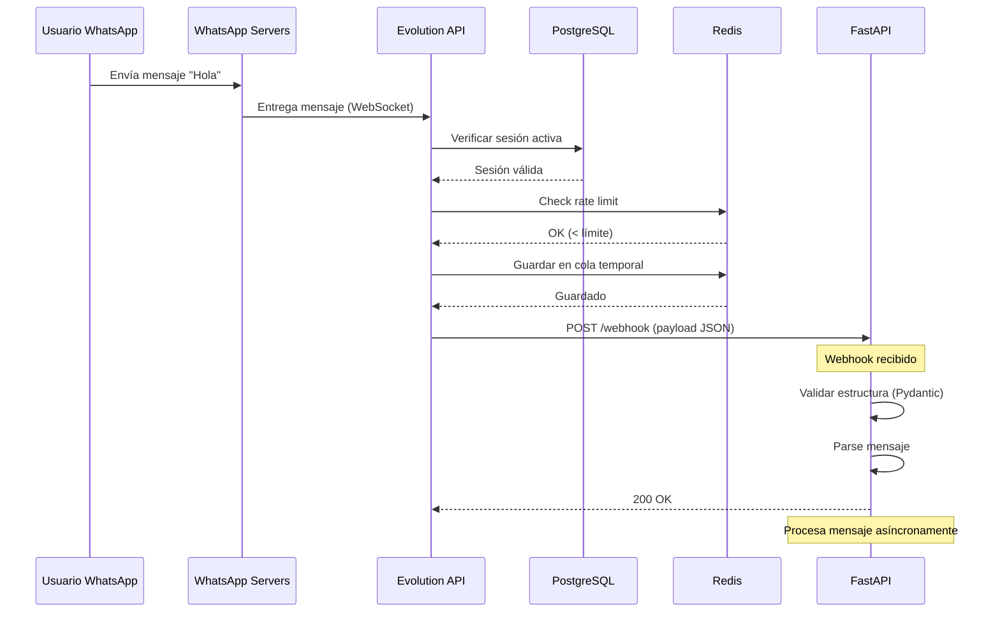
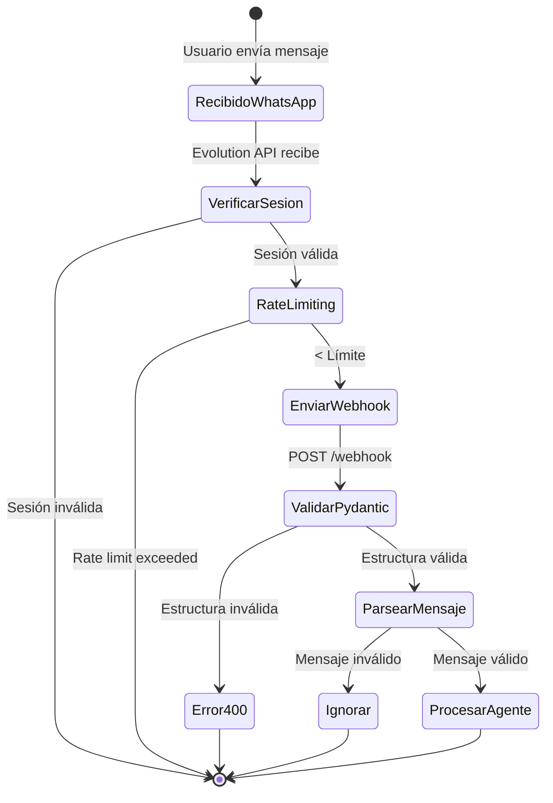

# 3.1 Recepción de Mensaje

## Flujo Completo desde WhatsApp hasta FastAPI



---

## Paso 1: Usuario Envía Mensaje

El usuario escribe un mensaje en WhatsApp:

```
Usuario: "¿Cuánto cuesta la matrícula?"
```

WhatsApp valida el mensaje localmente y lo envía a sus servidores.

---

## Paso 2: WhatsApp → Evolution API

Evolution API mantiene una **conexión WebSocket** persistente con WhatsApp (usando Baileys):

```javascript
// Internamente, Baileys (dentro de Evolution API) recibe:
{
  "key": {
    "remoteJid": "51999999999@s.whatsapp.net",
    "fromMe": false,
    "id": "3EB0123456789ABCDEF"
  },
  "message": {
    "conversation": "¿Cuánto cuesta la matrícula?"
  },
  "messageTimestamp": 1698765432,
  "pushName": "Juan Pérez"
}
```

---

## Paso 3: Evolution API Procesa el Mensaje

### 3.1 Verificar Sesión en PostgreSQL

```sql
SELECT session_data, status
FROM sessions
WHERE instance_name = 'sciencebot-production'
AND status = 'connected';
```

Si la sesión no está activa, Evolution API no puede procesar el mensaje.

### 3.2 Rate Limiting con Redis

```redis
# Incrementar contador de mensajes
INCR ratelimit:sciencebot:messages:1698765432
EXPIRE ratelimit:sciencebot:messages:1698765432 60

# Verificar límite
GET ratelimit:sciencebot:messages:1698765432
# Si > 20 → Rate limit exceeded
```

### 3.3 Guardar en Cola Temporal (Redis)

```redis
# Encolar mensaje para procesamiento
LPUSH queue:incoming:sciencebot '{
  "phone": "51999999999",
  "message": "¿Cuánto cuesta la matrícula?",
  "timestamp": 1698765432
}'
```

---

## Paso 4: Evolution API → FastAPI Webhook

Evolution API envía un **POST request** al webhook configurado:

```http
POST https://sciencebotunp-production.up.railway.app/webhook
Content-Type: application/json
X-Evolution-Event: messages.upsert

{
  "event": "messages.upsert",
  "instance": "sciencebot-production",
  "data": [
    {
      "key": {
        "remoteJid": "51999999999@s.whatsapp.net",
        "fromMe": false,
        "id": "3EB0123456789ABCDEF"
      },
      "pushName": "Juan Pérez",
      "messageTimestamp": 1698765432,
      "message": {
        "conversation": "¿Cuánto cuesta la matrícula?"
      }
    }
  ]
}
```

---

## Paso 5: FastAPI Recibe el Webhook

### Endpoint del Webhook

```python
# app/routes/webhook.py

from fastapi import APIRouter, Request
from app.models.webhook import WebhookPayload

router = APIRouter()

@router.post("/webhook")
async def handle_webhook(
    webhook: WebhookPayload,  # ⭐ Validación automática
    request: Request
):
    """Recibe webhooks de Evolution API."""

    # Log del evento
    print(f"[WEBHOOK] Received event: {webhook.event}")
    print(f"[WEBHOOK] Instance: {webhook.instance}")

    # Continúa el procesamiento...
    return {"status": "received"}
```

---

## Paso 6: Validación con Pydantic

FastAPI valida automáticamente la estructura del webhook:

```python
# app/models/webhook.py

from pydantic import BaseModel

class MessageKey(BaseModel):
    remoteJid: str          # "51999999999@s.whatsapp.net"
    fromMe: bool            # false
    id: str                 # "3EB0123456..."

class Message(BaseModel):
    conversation: str | None = None
    extendedTextMessage: dict | None = None

class MessageData(BaseModel):
    key: MessageKey
    message: Message
    pushName: str
    messageTimestamp: int

class WebhookPayload(BaseModel):
    event: str               # "messages.upsert"
    instance: str            # "sciencebot-production"
    data: list[MessageData]
```

**Si la estructura es incorrecta**, FastAPI retorna automáticamente:
```json
{
  "detail": [
    {
      "loc": ["body", "data", 0, "key"],
      "msg": "field required",
      "type": "value_error.missing"
    }
  ]
}
```

---

## Paso 7: Parsing del Mensaje

```python
# app/services/evolution_service.py

def parse_webhook_message(
    self, webhook_payload: WebhookPayload
) -> ParsedMessage | None:
    """Parse incoming webhook message from Evolution API."""
    try:
        # 1. Filtrar solo mensajes nuevos
        if webhook_payload.event not in ["messages.upsert", "MESSAGES_UPSERT"]:
            return None

        message_data = webhook_payload.data[0]

        # 2. Ignorar mensajes propios
        if message_data.key.fromMe:
            return None

        # 3. Extraer texto
        text = (
            message_data.message.conversation
            or (
                message_data.message.extendedTextMessage
                and message_data.message.extendedTextMessage.text
            )
            or ""
        )

        if not text:
            return None

        # 4. Crear ParsedMessage
        return ParsedMessage(
            phone_number=message_data.key.remoteJid.replace("@s.whatsapp.net", ""),
            text=text,
            from_me=message_data.key.fromMe,
            message_id=message_data.key.id,
            push_name=message_data.pushName,
            timestamp=message_data.messageTimestamp,
        )

    except Exception as e:
        print(f"[ERROR] Failed to parse message: {e}")
        return None
```

### ParsedMessage

```python
class ParsedMessage(BaseModel):
    phone_number: str        # "51999999999"
    text: str                # "¿Cuánto cuesta la matrícula?"
    from_me: bool            # False
    message_id: str          # "3EB0123456..."
    push_name: str           # "Juan Pérez"
    timestamp: int           # 1698765432
```

---

## Validaciones Iniciales

### 1. Filtrar Eventos No Deseados

```python
if webhook_payload.event not in ["messages.upsert", "MESSAGES_UPSERT"]:
    return None  # Ignorar connection.update, qr.updated, etc.
```

### 2. Ignorar Mensajes Propios

```python
if message_data.key.fromMe:
    return None  # No responder a mensajes que enviamos nosotros
```

### 3. Verificar que Hay Texto

```python
if not text:
    return None  # Ignorar stickers, imágenes sin caption, etc.
```

### 4. Validar Formato de Número

```python
# Formato WhatsApp: "51999999999@s.whatsapp.net"
# Extraemos: "51999999999"
phone_number = message_data.key.remoteJid.replace("@s.whatsapp.net", "")
```

---

## Tipos de Mensajes de WhatsApp

### 1. Mensaje Simple
```json
{
  "message": {
    "conversation": "Hola"
  }
}
```

### 2. Mensaje con Formato (Extended Text)
```json
{
  "message": {
    "extendedTextMessage": {
      "text": "Hola *mundo*",
      "contextInfo": {}
    }
  }
}
```

### 3. Respuesta a Mensaje (Quote)
```json
{
  "message": {
    "extendedTextMessage": {
      "text": "Sí, gracias",
      "contextInfo": {
        "quotedMessage": {}
      }
    }
  }
}
```

El código maneja todos estos casos:
```python
text = (
    message_data.message.conversation  # Caso 1
    or (
        message_data.message.extendedTextMessage  # Casos 2 y 3
        and message_data.message.extendedTextMessage.text
    )
    or ""
)
```

---

## Respuesta Inmediata al Webhook

```python
@router.post("/webhook")
async def handle_webhook(webhook: WebhookPayload, request: Request):
    # Parsear mensaje
    parsed = evolution_service.parse_webhook_message(webhook)

    if not parsed:
        # No es un mensaje válido, retornar inmediatamente
        return {"status": "ignored"}

    # ⭐ Retornar 200 OK inmediatamente
    # El procesamiento continúa en background
    return {"status": "processing"}
```

**¿Por qué retornar inmediatamente?**

Evolution API espera una respuesta rápida (< 5 segundos). Si tardamos más:
- Evolution API puede reenviar el webhook (duplicados)
- El usuario podría experimentar delays

**Solución**: Retornar 200 OK de inmediato y procesar el mensaje de forma asíncrona.

---

## Diagrama de Estados



---

## Manejo de Errores

### Error 1: Estructura Inválida
```python
# FastAPI retorna automáticamente 422 Unprocessable Entity
{
  "detail": "Invalid webhook structure"
}
```

### Error 2: Sesión Inactiva en Evolution
```
Evolution API no envía webhook (sin conexión a WhatsApp)
```

### Error 3: Rate Limit
```
Evolution API no envía webhook (límite excedido)
```

### Error 4: Parsing Fallido
```python
# Retornar 200 OK pero no procesar
return {"status": "ignored", "reason": "failed_to_parse"}
```

---

## Próximos Pasos

Después de recibir y parsear el mensaje, el flujo continúa en:

- **[3.2 Procesamiento del Agente](./3.2-procesamiento-agente.md)**: LangGraph procesa la consulta
- **[3.3 Búsqueda de Documentos](./3.3-busqueda-documentos.md)**: Pipeline de búsqueda

**Volver al índice**: [../README.md](../README.md)
