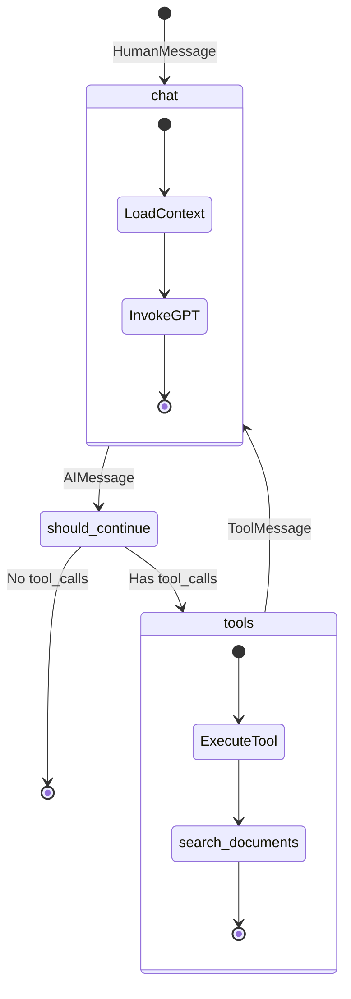
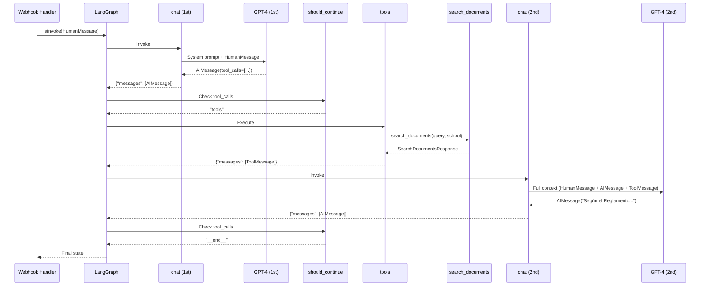

# 3.2 Procesamiento del Agente

## Inicialización del Grafo

El grafo de LangGraph se inicializa **una sola vez** al arrancar el servidor:

```python
# app/lifespan.py

@asynccontextmanager
async def lifespan(app: FastAPI):
    # 🟢 STARTUP
    print("[INFO] Initializing LangGraph agent...")
    graph = get_graph()  # Compilar el grafo
    app.state.science_bot_graph = graph  # Guardar en app.state
    print("[INFO] Agent ready!")

    yield

    # 🔴 SHUTDOWN
    print("[INFO] Shutting down...")
```

**Ventaja**: El grafo compilado está listo para usarse en cada request, sin overhead de compilación.

---

## Invocación del Agente

```python
# app/routes/webhook.py

@router.post("/webhook")
async def handle_webhook(webhook: WebhookPayload, request: Request):
    # 1. Parsear mensaje
    parsed = evolution_service.parse_webhook_message(webhook)

    if not parsed:
        return {"status": "ignored"}

    # 2. Obtener grafo desde app.state
    graph = request.app.state.science_bot_graph

    # 3. Invocar agente
    response = await graph.ainvoke(
        input={
            "messages": [
                HumanMessage(content=parsed.text)
            ]
        },
        config={
            "phone_number": parsed.phone_number
        }
    )

    # 4. Extraer respuesta final
    final_message = response["messages"][-1].content

    # 5. Enviar respuesta
    await evolution_service.send_message(
        phone_number=parsed.phone_number,
        message=final_message,
        instance_name="sciencebot-production"
    )

    return {"status": "processed"}
```

---

## Flujo del Grafo: chat → tools → chat



---

## Nodo 1: chat (Primera Invocación)

### Input
```python
{
    "messages": [
        HumanMessage(content="¿Cuánto cuesta la matrícula en Informática?")
    ]
}
```

### Procesamiento
```python
async def chat(state: InputState, config: RunnableConfig):
    # 1. Cargar contexto
    context = Context.from_config(config)  # phone_number

    # 2. Modelo con tools
    model = ChatOpenAI(model="gpt-4o-mini", temperature=0)
    model_with_tools = model.bind_tools(tools=TOOLS, strict=True)

    # 3. System prompt
    prompt = ChatPromptTemplate.from_messages([
        ("system", get_system_prompt(phone_number=context.phone_number)),
        MessagesPlaceholder(variable_name="messages"),
    ])

    # 4. Invocar
    response = await (prompt | model_with_tools).ainvoke(
        input={"messages": state.messages}
    )

    return {"messages": [response]}
```

### Output (GPT-4 decide usar tool)
```python
AIMessage(
    content="",
    tool_calls=[{
        "name": "search_documents",
        "args": {
            "query": "costo de matrícula",
            "school": "INFORMATICA"
        }
    }]
)
```

---

## Conditional Edge: should_continue

```python
async def should_continue(state: OverallState) -> Literal["tools", "__end__"]:
    last_message = state.messages[-1]

    if last_message.tool_calls:
        return "tools"  # → Ejecutar herramientas

    return "__end__"    # → Finalizar
```

**Decisión**: Como el mensaje tiene `tool_calls`, el flujo continúa hacia el nodo `tools`.

---

## Nodo 2: tools (Ejecución de Herramientas)

```python
# ToolNode ejecuta automáticamente las tools
from langgraph.prebuilt import ToolNode

graph_builder.add_node(node="tools", action=ToolNode(tools=TOOLS))
```

### Input (del mensaje anterior)
```python
tool_calls=[{
    "name": "search_documents",
    "args": {
        "query": "costo de matrícula",
        "school": "INFORMATICA"
    }
}]
```

### Procesamiento
```python
# ToolNode internamente hace:
1. Encuentra la función search_documents
2. Extrae args
3. Ejecuta: result = await search_documents(query="costo de matrícula", school="INFORMATICA")
4. Crea ToolMessage con el resultado
```

### Output
```python
ToolMessage(
    content='{"success": true, "message": "Según el Reglamento de Pagos 2024, el costo de matrícula es de S/ 350 soles..."}',
    tool_call_id="call_abc123"
)
```

---

## Nodo 3: chat (Segunda Invocación)

Después de ejecutar la tool, el grafo vuelve al nodo `chat`:

### Input (estado actualizado)
```python
{
    "messages": [
        HumanMessage(content="¿Cuánto cuesta la matrícula en Informática?"),
        AIMessage(content="", tool_calls=[...]),
        ToolMessage(content="...S/ 350 soles...")
    ]
}
```

### Procesamiento
GPT-4 ahora tiene todo el contexto:
- Pregunta original del usuario
- Decisión de usar search_documents
- Resultado de la búsqueda

```python
# GPT-4 genera respuesta final combinando toda la info
response = await model.ainvoke([
    SystemMessage("Eres un asistente..."),
    HumanMessage("¿Cuánto cuesta la matrícula en Informática?"),
    AIMessage(tool_calls=[...]),
    ToolMessage("...S/ 350 soles...")
])
```

### Output (respuesta final)
```python
AIMessage(
    content="Según el Reglamento de Pagos 2024, el costo de matrícula para Ingeniería Informática es de S/ 350 soles. Este pago debe realizarse al inicio de cada semestre académico."
)
```

---

## Conditional Edge: should_continue (segunda vez)

```python
last_message = state.messages[-1]

if last_message.tool_calls:  # No hay tool_calls esta vez
    return "tools"

return "__end__"  # ✅ Finalizar grafo
```

**Decisión**: Como no hay más `tool_calls`, el grafo finaliza y retorna el estado completo.

---

## Estado Final

```python
{
    "messages": [
        HumanMessage(content="¿Cuánto cuesta la matrícula en Informática?"),
        AIMessage(content="", tool_calls=[{...}]),
        ToolMessage(content="...S/ 350 soles..."),
        AIMessage(content="Según el Reglamento de Pagos 2024, el costo de matrícula para Ingeniería Informática es de S/ 350 soles. Este pago debe realizarse al inicio de cada semestre académico.")
    ]
}
```

---

## Extracción de la Respuesta Final

```python
# En el webhook handler
response = await graph.ainvoke(...)

# Extraer último mensaje (respuesta del AI)
final_message = response["messages"][-1].content

# "Según el Reglamento de Pagos 2024, el costo de matrícula..."
```

---

## Casos de Uso

### Caso 1: Sin Tool (Respuesta Directa)

**Input**: "Hola"

**Flujo**:
```
chat → AIMessage("¡Hola! Soy ScienceBot...")
→ should_continue → __end__
```

**Resultado**: Una sola invocación a GPT-4, sin herramientas.

### Caso 2: Con Tool (Búsqueda)

**Input**: "¿Cuánto cuesta la matrícula?"

**Flujo**:
```
chat → AIMessage(tool_calls=[...])
→ should_continue → tools
→ tools → ToolMessage(...)
→ chat → AIMessage("Según el Reglamento...")
→ should_continue → __end__
```

**Resultado**: Dos invocaciones a GPT-4 + una ejecución de tool.

---

## Diagrama de Secuencia Completo



---

## Performance

```
Tiempos típicos:

1. chat (1st invocation): ~800ms
   - GPT-4o-mini es rápido
   - Decide usar tool

2. tools (search_documents): ~2500ms
   - Get documents: 50ms
   - Select document: 800ms (GPT-4)
   - Vector Search: 100ms
   - Generate answer: 1500ms (GPT-4)

3. chat (2nd invocation): ~1000ms
   - Genera respuesta final

TOTAL: ~4.3 segundos
```

---

## Próximos Pasos

- **[3.3 Búsqueda de Documentos](./3.3-busqueda-documentos.md)**: Detalle del pipeline de búsqueda
- **[3.4 Respuesta al Usuario](./3.4-respuesta-usuario.md)**: Envío via Evolution API

**Volver al índice**: [../README.md](../README.md)
