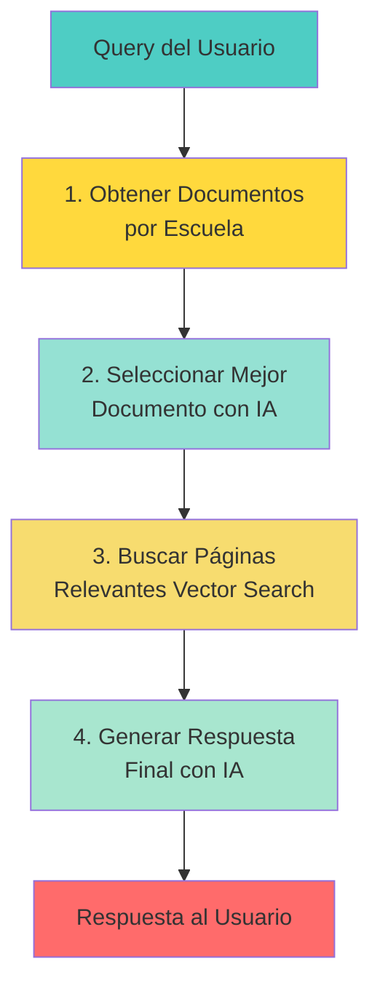
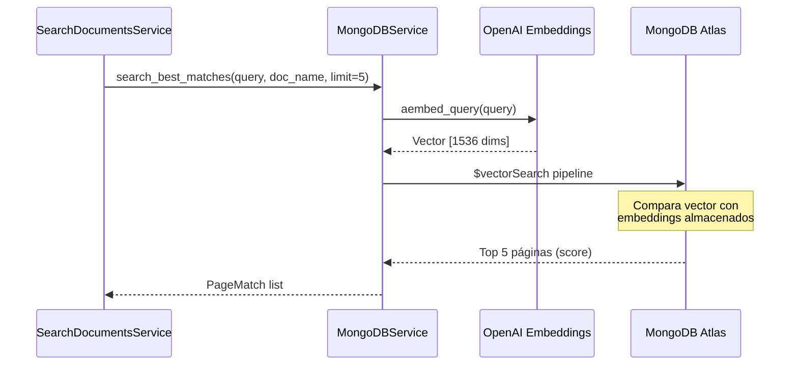
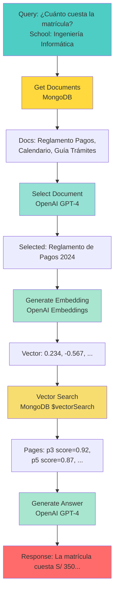

# 3.3 Búsqueda de Documentos

## Pipeline Completo de SearchDocumentsService

El servicio de búsqueda ejecuta un **pipeline de 4 pasos** para encontrar y generar respuestas basadas en documentos académicos.



---

## Código del Pipeline

```python
# app/science_bot/agent/tools/search_documents/service.py

class SearchDocumentsService:
    async def search_and_answer(
        self, query: str, school: str, max_pages: int = 5
    ) -> SearchDocumentsServiceResponse:
        """Pipeline completo de búsqueda y generación de respuesta."""

        # PASO 1: Obtener documentos relevantes
        documents = await self.get_relevant_documents(school)

        if not documents:
            return SearchDocumentsServiceResponse(
                success=False,
                message=f"No documents found for school: {school}",
            )

        # PASO 2: Seleccionar mejor documento con IA
        selected_document = await self.select_best_document(query, documents)

        # PASO 3: Buscar páginas relevantes con Vector Search
        pages = await self.search_in_document(
            query, selected_document, limit=max_pages
        )

        if not pages:
            return SearchDocumentsServiceResponse(
                success=False,
                message=f"No relevant information found in: {selected_document}",
                document_used=selected_document,
            )

        # PASO 4: Generar respuesta final con IA
        answer_response = await self.generate_answer(
            query, selected_document, pages
        )

        return SearchDocumentsServiceResponse(
            success=True,
            message=answer_response.answer,
            document_used=answer_response.document_used,
            pages_count=len(pages),
        )
```

---

## Paso 1: Obtener Documentos por Escuela

```python
async def get_relevant_documents(self, school: str) -> list[DocumentInfo]:
    """Obtiene documentos de la escuela + Información General."""

    # Documentos de la escuela específica
    school_docs = await self.mongo_service.get_documents_by_school(school)

    # Documentos generales (aplican a todas las escuelas)
    general_docs = await self.mongo_service.get_documents_by_school(
        "Información General"
    )

    # Combinar ambos
    all_documents = school_docs.documents + general_docs.documents

    return all_documents
```

### Ejemplo de Resultado

```python
[
    DocumentInfo(
        id="507f1f77bcf86cd799439011",
        name="Reglamento de Pagos 2024",
        type="Ingeniería Informática",
        description="Reglamento de pagos, matrículas y pensiones."
    ),
    DocumentInfo(
        id="507f1f77bcf86cd799439012",
        name="Calendario Académico 2024",
        type="Información General",
        description="Fechas importantes del año académico."
    ),
    # ... más documentos
]
```

**¿Por qué Información General?**

Algunos documentos son aplicables a todas las escuelas:
- Calendario académico
- Reglamento general de estudiantes
- Directorio de contactos

---

## Paso 2: Seleccionar Mejor Documento con IA

```python
async def select_best_document(
    self, query: str, documents: list[DocumentInfo]
) -> str:
    """Usa OpenAI para seleccionar el documento más relevante."""

    # Formatear lista de documentos
    documents_list = "\n\n".join([
        f"Document: {doc.name}\nType: {doc.type}\nDescription: {doc.description}"
        for doc in documents
    ])

    # Prompt para IA
    messages = [
        SystemMessage(content=DOCUMENT_SELECTOR_SYSTEM_PROMPT),
        HumanMessage(content=DOCUMENT_SELECTOR_USER_PROMPT_TEMPLATE.format(
            query=query,
            documents_list=documents_list
        ))
    ]

    # Invocar OpenAI
    response = await self.llm.ainvoke(messages)
    selected_document = str(response.content).strip()

    return selected_document
```

### System Prompt (Document Selector)

```python
DOCUMENT_SELECTOR_SYSTEM_PROMPT = """
Eres un experto en seleccionar documentos relevantes.

Tu tarea es:
1. Analizar la pregunta del usuario
2. Revisar los documentos disponibles y sus descripciones
3. Seleccionar el documento MÁS relevante para responder la pregunta
4. Retornar ÚNICAMENTE el nombre exacto del documento

Reglas:
- Retorna SOLO el nombre del documento, sin explicaciones
- Si hay empate, selecciona el más específico
- Si ninguno es relevante, selecciona "Información General"
"""
```

### User Prompt Template

```python
DOCUMENT_SELECTOR_USER_PROMPT_TEMPLATE = """
Pregunta del usuario: {query}

Documentos disponibles:
{documents_list}

¿Qué documento es el más relevante para responder la pregunta?
Retorna SOLO el nombre del documento.
"""
```

### Ejemplo de Ejecución

**Input**:
```
Pregunta: "¿Cuánto cuesta la matrícula?"

Documentos:
- Reglamento de Pagos 2024
- Calendario Académico 2024
- Guía de Trámites
```

**Output**:
```
Reglamento de Pagos 2024
```

---

## Paso 3: Buscar Páginas con Vector Search

```python
async def search_in_document(
    self, query: str, document_name: str, limit: int = 10
) -> list[PageMatch]:
    """Busca páginas relevantes usando embeddings."""

    result = await self.mongo_service.search_best_matches(
        query=query,
        document_name=document_name,
        limit=limit
    )

    return result.matches
```

### Flujo de Vector Search



### MongoDB Pipeline

```python
pipeline = [
    {
        "$vectorSearch": {
            "index": "default",
            "queryVector": query_embedding,      # [0.123, -0.456, ...]
            "path": "embedding",
            "numCandidates": limit * 10,         # 50 candidatos
            "limit": limit,                      # Top 5 resultados
            "filter": {"nombre_archivo": document_name}
        }
    },
    {
        "$project": {
            "_id": 1,
            "nombre_archivo": 1,
            "pagina": 1,
            "text": 1,
            "score": {"$meta": "vectorSearchScore"}
        }
    }
]
```

### Resultado del Vector Search

```python
[
    PageMatch(
        id="507f1f77bcf86cd799439013",
        file_name="Reglamento de Pagos 2024",
        page=3,
        text="Artículo 15: El costo de matrícula para pregrado es de S/ 350 soles...",
        score=0.92  # 92% de similitud
    ),
    PageMatch(
        id="507f1f77bcf86cd799439014",
        file_name="Reglamento de Pagos 2024",
        page=5,
        text="Para realizar el pago de matrícula, el estudiante debe...",
        score=0.87  # 87% de similitud
    ),
    # ... más páginas
]
```

---

## Paso 4: Generar Respuesta con IA

```python
async def generate_answer(
    self, query: str, document_name: str, pages: list[PageMatch]
) -> AnswerGenerationResponse:
    """Genera respuesta final usando contexto de páginas."""

    # Formatear contexto de páginas
    pages_content = "\n\n---\n\n".join([
        f"[Page {page.page}]\n{page.text}\n(Relevance: {page.score:.4f})"
        for page in pages
    ])

    # Prompt para IA
    messages = [
        SystemMessage(content=ANSWER_GENERATOR_SYSTEM_PROMPT),
        HumanMessage(content=ANSWER_GENERATOR_USER_PROMPT_TEMPLATE.format(
            query=query,
            document_name=document_name,
            pages_content=pages_content,
        ))
    ]

    # Invocar OpenAI
    response = await self.llm.ainvoke(messages)

    return AnswerGenerationResponse(
        answer=str(response.content).strip(),
        document_used=document_name,
        pages_referenced=[page.page for page in pages],
    )
```

### System Prompt (Answer Generator)

```python
ANSWER_GENERATOR_SYSTEM_PROMPT = """
Eres un asistente académico experto de la Universidad Nacional de Piura.

Tu tarea es:
1. Analizar el contexto proporcionado (páginas relevantes)
2. Generar una respuesta clara y concisa a la pregunta del usuario
3. Citar la fuente (documento y página) cuando sea apropiado

Reglas:
- Responde SOLO con información del contexto proporcionado
- Sé claro y directo
- Usa un tono amable y profesional
- Cita la página cuando menciones información específica
- Si el contexto no tiene la información, dilo honestamente
"""
```

### User Prompt Template

```python
ANSWER_GENERATOR_USER_PROMPT_TEMPLATE = """
Pregunta del usuario: {query}

Documento: {document_name}

Contexto relevante:
{pages_content}

Por favor, genera una respuesta clara y completa a la pregunta del usuario
basándote en el contexto proporcionado.
"""
```

### Ejemplo de Respuesta Generada

**Input**:
```
Pregunta: "¿Cuánto cuesta la matrícula?"
Documento: "Reglamento de Pagos 2024"
Páginas: [Page 3: "...S/ 350 soles...", Page 5: "...modalidades de pago..."]
```

**Output**:
```
Según el Reglamento de Pagos 2024, el costo de matrícula para pregrado
en Ingeniería Informática es de S/ 350 soles (página 3).

Puedes realizar el pago en las siguientes modalidades:
- Pago único en ventanilla
- Pago fraccionado (consultar en tesorería)

Para más información sobre el proceso de pago, consulta la página 5 del
mismo documento.
```

---

## Diagrama de Flujo Completo



---

## Performance del Pipeline

```
Tiempos promedio:
1. Get documents: ~50ms (MongoDB query)
2. Select document: ~800ms (OpenAI GPT-4o-mini)
3. Vector Search: ~100ms (MongoDB Vector Search)
4. Generate answer: ~1500ms (OpenAI GPT-4o-mini)

TOTAL: ~2.5 segundos
```

---

## Optimizaciones

### 1. **Caché de Documentos**

```python
# Cache lista de documentos por escuela (cambian poco)
@lru_cache(maxsize=128)
async def get_documents_by_school_cached(school: str):
    return await mongo.get_documents_by_school(school)
```

### 2. **Batch Embeddings**

```python
# Si se hacen múltiples queries, generar embeddings en batch
embeddings = await openai.aembed_documents([query1, query2, query3])
```

### 3. **Ajustar `numCandidates`**

```python
# Menos candidatos = más rápido, pero menos precisión
"numCandidates": limit * 5  # En lugar de limit * 10
```

---

## Recursos Adicionales

- **[6.3 Búsqueda Semántica](../6-base-de-datos/6.3-busqueda-semantica.md)**: Vector Search en detalle
- **[5.2 Herramientas](../5-modelo-agente/5.2-herramientas.md)**: search_documents tool

**Volver al índice**: [../README.md](../README.md)
