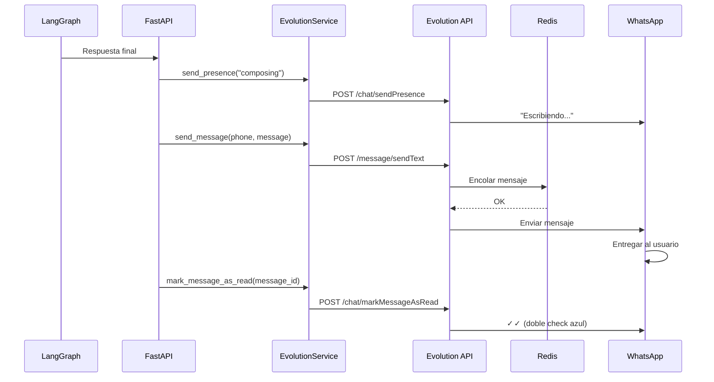

# 3.4 Respuesta al Usuario

## Flujo de Respuesta

Después de que LangGraph genera la respuesta, se envía al usuario via Evolution API:



---

## Paso 1: Enviar Presencia (Typing Indicator)

Mostrar "escribiendo..." mientras se procesa:

```python
# app/routes/webhook.py

# Antes de generar la respuesta
await evolution_service.send_presence(
    phone_number=parsed.phone_number,
    instance_name="sciencebot-production",
    state="composing",  # "escribiendo..."
    delay=3000  # 3 segundos
)
```

### Implementación

```python
# app/services/evolution_service.py

async def send_presence(
    self,
    phone_number: str,
    instance_name: str,
    state: str = "composing",
    delay: int = 3000,
) -> PresenceResponse:
    """Envía estado de presencia a WhatsApp."""

    url = f"{self.base_url}/chat/sendPresence/{instance_name}"

    payload = {
        "number": self._format_phone_number(phone_number),
        "presence": state,  # composing | recording | available
        "delay": delay
    }

    async with httpx.AsyncClient() as client:
        try:
            response = await client.post(
                url=url,
                json=payload,
                headers=self._get_headers()
            )
            response.raise_for_status()

            return PresenceResponse(error=False, message="Presence sent")

        except httpx.HTTPError as e:
            return PresenceResponse(error=True, message=str(e))
```

### Request a Evolution API

```http
POST /chat/sendPresence/sciencebot-production
Content-Type: application/json
apikey: your_api_key

{
  "number": "51999999999",
  "presence": "composing",
  "delay": 3000
}
```

---

## Paso 2: Enviar Mensaje

```python
# app/routes/webhook.py

await evolution_service.send_message(
    phone_number=parsed.phone_number,
    message=final_message,
    instance_name="sciencebot-production"
)
```

### Implementación

```python
# app/services/evolution_service.py

async def send_message(
    self, phone_number: str, message: str, instance_name: str
) -> SendMessageResponse:
    """Envía mensaje de texto a WhatsApp."""

    url = f"{self.base_url}/message/sendText/{instance_name}"

    payload = {
        "number": self._format_phone_number(phone_number),
        "text": message
    }

    async with httpx.AsyncClient() as client:
        try:
            response = await client.post(
                url=url,
                json=payload,
                headers=self._get_headers()
            )
            response.raise_for_status()

            return SendMessageResponse(
                error=False,
                message="Message sent successfully"
            )

        except httpx.HTTPError as e:
            return SendMessageResponse(error=True, message=str(e))
```

### Request a Evolution API

```http
POST /message/sendText/sciencebot-production
Content-Type: application/json
apikey: your_api_key

{
  "number": "51999999999",
  "text": "Según el Reglamento de Pagos 2024, el costo de matrícula para Ingeniería Informática es de S/ 350 soles."
}
```

---

## Paso 3: Marcar Mensaje como Leído

Mostrar doble check azul en el mensaje del usuario:

```python
# app/routes/webhook.py

await evolution_service.mark_message_as_read(
    phone_number=parsed.phone_number,
    instance_name="sciencebot-production",
    message_id=parsed.message_id
)
```

### Implementación

```python
# app/services/evolution_service.py

async def mark_message_as_read(
    self, phone_number: str, instance_name: str, message_id: str
) -> ReadMessageResponse:
    """Marca mensaje como leído (doble check azul)."""

    url = f"{self.base_url}/chat/markMessageAsRead/{instance_name}"

    formatted_number = self._format_phone_number(phone_number)
    remote_jid = f"{formatted_number}@s.whatsapp.net"

    payload = {
        "readMessages": [
            {
                "remoteJid": remote_jid,
                "id": message_id,
                "fromMe": False
            }
        ]
    }

    async with httpx.AsyncClient() as client:
        try:
            response = await client.post(
                url=url,
                json=payload,
                headers=self._get_headers()
            )
            response.raise_for_status()

            return ReadMessageResponse(
                error=False,
                message="Message marked as read"
            )

        except httpx.HTTPError as e:
            return ReadMessageResponse(error=True, message=str(e))
```

### Request a Evolution API

```http
POST /chat/markMessageAsRead/sciencebot-production
Content-Type: application/json
apikey: your_api_key

{
  "readMessages": [
    {
      "remoteJid": "51999999999@s.whatsapp.net",
      "id": "3EB0123456789ABCDEF",
      "fromMe": false
    }
  ]
}
```

---

## Formato de Números de Teléfono

```python
def _format_phone_number(self, phone_number: str) -> str:
    """Remueve caracteres no numéricos."""
    return re.sub(pattern=r"[^\d]", repl="", string=phone_number)
```

**Ejemplos**:
- `+51 999 999 999` → `51999999999`
- `(999) 999-999` → `999999999`
- `51-999-999-999` → `51999999999`

**Formato WhatsApp JID**:
```python
remote_jid = f"{formatted_number}@s.whatsapp.net"
# "51999999999@s.whatsapp.net"
```

---

## Headers de Autenticación

```python
def _get_headers(self) -> dict[str, str]:
    """Headers para requests a Evolution API."""
    return {
        "apikey": self.api_key,
        "Content-Type": "application/json",
    }
```

---

## Manejo de Errores

### Error: Evolution API Caído

```python
try:
    await evolution_service.send_message(...)
except httpx.ConnectError as e:
    print(f"[ERROR] Cannot connect to Evolution API: {e}")
    # Guardar mensaje en cola para reintentar después
```

### Error: Rate Limit de WhatsApp

```python
try:
    response = await client.post(...)
    response.raise_for_status()
except httpx.HTTPStatusError as e:
    if e.response.status_code == 429:
        print("[ERROR] Rate limit exceeded")
        # Esperar y reintentar
```

### Error: Número Bloqueado

```python
# Evolution API retorna error si el número bloqueó al bot
{
  "error": true,
  "message": "Number blocked by user"
}
```

---

## Optimización: Async Concurrent

Enviar presencia, mensaje y marcar como leído **en paralelo**:

```python
import asyncio

# Ejecutar tareas concurrentes
await asyncio.gather(
    evolution_service.send_presence(...),
    evolution_service.send_message(...),
    evolution_service.mark_message_as_read(...)
)
```

**Ventaja**: Reduce tiempo total de ~300ms a ~100ms.

---

## Webhook Handler Completo

```python
# app/routes/webhook.py

@router.post("/webhook")
async def handle_webhook(
    webhook: WebhookPayload,
    request: Request
):
    # 1. Parsear mensaje
    parsed = evolution_service.parse_webhook_message(webhook)

    if not parsed:
        return {"status": "ignored"}

    # 2. Enviar "escribiendo..."
    await evolution_service.send_presence(
        phone_number=parsed.phone_number,
        instance_name="sciencebot-production",
        state="composing",
        delay=3000
    )

    # 3. Procesar con agente
    graph = request.app.state.science_bot_graph

    response = await graph.ainvoke(
        input={"messages": [HumanMessage(content=parsed.text)]},
        config={"phone_number": parsed.phone_number}
    )

    final_message = response["messages"][-1].content

    # 4. Enviar respuesta + marcar como leído (paralelo)
    await asyncio.gather(
        evolution_service.send_message(
            phone_number=parsed.phone_number,
            message=final_message,
            instance_name="sciencebot-production"
        ),
        evolution_service.mark_message_as_read(
            phone_number=parsed.phone_number,
            instance_name="sciencebot-production",
            message_id=parsed.message_id
        )
    )

    return {"status": "processed"}
```

---

## Experiencia del Usuario

```
Usuario: ¿Cuánto cuesta la matrícula?
[Envía mensaje]

Bot: ✓✓ (doble check azul - mensaje leído)
Bot: "Escribiendo..." (3 segundos)

Bot: Según el Reglamento de Pagos 2024, el costo de
     matrícula para Ingeniería Informática es de S/ 350 soles.
     [Enviado]
```

---

## Recursos Adicionales

- **[2.1 Evolution API](../2-componentes/2.1-evolution-api.md)**: Detalles de Evolution API
- **[4.2 Integración Evolution](../4-servicios-externos/4.2-evolution-integracion.md)**: Más detalles técnicos

**Volver al índice**: [../README.md](../README.md)
