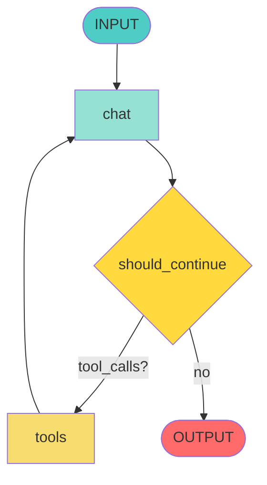

# 5.1 Estructura del Grafo LangGraph

## Código Completo del Grafo

```python
# app/science_bot/agent/graph.py

from langgraph.graph import StateGraph
from langgraph.prebuilt import ToolNode
from langchain_openai import ChatOpenAI
from langchain_core.prompts import ChatPromptTemplate, MessagesPlaceholder

# ============================================================================
# DEFINICIÓN DE ESTADOS
# ============================================================================

class InputState(BaseModel):
    """Estado de entrada del usuario."""
    messages: list[BaseMessage]

class OverallState(BaseModel):
    """Estado completo durante la ejecución."""
    messages: list[BaseMessage]

class OutputState(BaseModel):
    """Estado de salida."""
    messages: list[BaseMessage]

class Context(BaseModel):
    """Contexto adicional (inmutable)."""
    phone_number: str

    @classmethod
    def from_config(cls, config: RunnableConfig) -> "Context":
        return cls(phone_number=config.get("phone_number", "unknown"))

# ============================================================================
# CREACIÓN DEL GRAFO
# ============================================================================

graph_builder: StateGraph[OverallState, Context, InputState, OutputState] = StateGraph(
    state_schema=OverallState,     # Estado durante ejecución
    input_schema=InputState,       # Entrada del usuario
    output_schema=OutputState,     # Salida final
    context_schema=Context,        # Contexto (phone_number)
)

# ============================================================================
# NODO 1: CHAT (LLM con Tools)
# ============================================================================

async def chat(
    state: InputState, config: RunnableConfig
) -> dict[str, list[BaseMessage]]:
    """Nodo principal que invoca OpenAI GPT-4o-mini con tools."""

    # 1. Extraer contexto
    context = Context.from_config(config)

    # 2. Configurar modelo
    model = ChatOpenAI(
        model=settings.OPENAI_MODEL,                    # gpt-4o-mini
        api_key=SecretStr(settings.OPENAI_API_KEY),
        max_completion_tokens=settings.OPENAI_MAX_TOKENS,  # 1000
        temperature=settings.OPENAI_TEMPERATURE,        # 0
    )

    # 3. Bind tools con strict mode
    try:
        model_with_tools = model.bind_tools(tools=TOOLS, strict=True)
    except Exception as e:
        print(f"[ERROR] Failed to bind tools: {str(e)}")
        raise

    # 4. Crear prompt con system message
    system_prompt_text = get_system_prompt(phone_number=context.phone_number)

    prompt: ChatPromptTemplate = ChatPromptTemplate.from_messages([
        ("system", system_prompt_text),
        MessagesPlaceholder(variable_name="messages"),
    ])

    # 5. Invocar modelo
    try:
        response: BaseMessage = await (prompt | model_with_tools).ainvoke(
            input={"messages": state.messages}
        )
        return {"messages": [response]}
    except Exception as e:
        print(f"[ERROR] Error type: {type(e).__name__}")
        print(f"[ERROR] Error message: {str(e)}")
        raise

# ============================================================================
# CONDITIONAL EDGE: SHOULD_CONTINUE
# ============================================================================

async def should_continue(state: OverallState) -> Literal["tools"] | Literal["__end__"]:
    """Decide si ejecutar tools o finalizar."""
    messages = state.messages
    last_message: BaseMessage = messages[-1]

    if last_message.tool_calls:  # ¿Tiene llamadas a tools?
        return "tools"

    return "__end__"

# ============================================================================
# CONFIGURACIÓN DEL GRAFO
# ============================================================================

# Agregar nodos
graph_builder.add_node(node="chat", action=chat)
graph_builder.add_node(node="tools", action=ToolNode(tools=TOOLS))

# Set entry point
graph_builder.set_entry_point("chat")

# Agregar edges
graph_builder.add_conditional_edges(
    source="chat",
    path=should_continue,
    path_map=["tools", "__end__"]
)
graph_builder.add_edge(start_key="tools", end_key="chat")

# ============================================================================
# COMPILACIÓN
# ============================================================================

def get_graph() -> Graph:
    """Compila y retorna el grafo."""
    return graph_builder.compile()
```

---

## Análisis Detallado

### 1. Estados (State Schemas)

#### InputState
```python
class InputState(BaseModel):
    messages: list[BaseMessage]
```

**Propósito**: Define qué recibe el grafo del usuario.

**Ejemplo**:
```python
{
    "messages": [
        HumanMessage(content="¿Cuánto cuesta la matrícula?")
    ]
}
```

#### OverallState
```python
class OverallState(BaseModel):
    messages: list[BaseMessage]
```

**Propósito**: Estado completo durante la ejecución del grafo.

**Evolución**:
```python
# Inicio
{"messages": [HumanMessage("¿Cuánto cuesta?")]}

# Después del chat
{"messages": [
    HumanMessage("¿Cuánto cuesta?"),
    AIMessage(tool_calls=[...])
]}

# Después de tools
{"messages": [
    HumanMessage("¿Cuánto cuesta?"),
    AIMessage(tool_calls=[...]),
    ToolMessage(content="S/ 350")
]}

# Final
{"messages": [
    HumanMessage("¿Cuánto cuesta?"),
    AIMessage(tool_calls=[...]),
    ToolMessage(content="S/ 350"),
    AIMessage(content="La matrícula cuesta S/ 350 soles.")
]}
```

#### OutputState
```python
class OutputState(BaseModel):
    messages: list[BaseMessage]
```

**Propósito**: Define qué retorna el grafo.

#### Context
```python
class Context(BaseModel):
    phone_number: str

    @classmethod
    def from_config(cls, config: RunnableConfig) -> "Context":
        return cls(phone_number=config.get("phone_number", "unknown"))
```

**Propósito**: Información adicional inmutable (no modificable por el grafo).

**Uso**:
```python
response = await graph.ainvoke(
    input={"messages": [...]},
    config={"phone_number": "51999999999"}  # ⭐ Context
)
```

---

### 2. Nodo: chat

```python
async def chat(state: InputState, config: RunnableConfig) -> dict:
    # Retorna dict con key "messages" que se agrega al estado
    return {"messages": [response]}
```

**Responsabilidades**:
1. Extraer contexto (phone_number)
2. Configurar modelo OpenAI
3. Bind tools con strict mode
4. Crear system prompt
5. Invocar modelo
6. Retornar respuesta

**Parámetros del modelo**:
```python
model = ChatOpenAI(
    model="gpt-4o-mini",           # Modelo económico y rápido
    max_completion_tokens=1000,    # Máximo 1000 tokens de respuesta
    temperature=0,                 # Determinístico (sin creatividad)
)
```

**Bind tools con strict=True**:
```python
model_with_tools = model.bind_tools(tools=TOOLS, strict=True)
```

`strict=True` hace que OpenAI siga **estrictamente** el schema de la tool (Structured Outputs).

**System Prompt**:
```python
system_prompt_text = get_system_prompt(phone_number=context.phone_number)
```

Ejemplo:
```
Eres un asistente virtual de la Universidad Nacional de Piura.

Usuario: 51999999999

Instrucciones:
- Responde preguntas sobre información académica
- Si necesitas buscar información, usa la herramienta search_documents
- Siempre pregunta la escuela antes de buscar información específica
- Sé amable y profesional
```

---

### 3. ToolNode

```python
graph_builder.add_node(node="tools", action=ToolNode(tools=TOOLS))
```

**ToolNode** es una clase de LangGraph que:
1. Lee `tool_calls` del último mensaje AI
2. Encuentra la función correspondiente
3. Extrae argumentos
4. Ejecuta la función (async)
5. Retorna `ToolMessage` con el resultado

**Ejemplo**:

Input (AIMessage):
```python
AIMessage(
    content="",
    tool_calls=[{
        "name": "search_documents",
        "args": {"query": "costo matrícula", "school": "INFORMATICA"}
    }]
)
```

Output (ToolMessage):
```python
ToolMessage(
    content='{"success": true, "message": "La matrícula cuesta S/ 350..."}',
    tool_call_id="call_abc123"
)
```

---

### 4. Conditional Edge: should_continue

```python
async def should_continue(state: OverallState) -> Literal["tools", "__end__"]:
    last_message = state.messages[-1]

    if last_message.tool_calls:
        return "tools"      # → Ir al nodo "tools"

    return "__end__"        # → Finalizar grafo
```

**Lógica**:
- Si el último mensaje (AI) tiene `tool_calls` → ejecutar herramientas
- Si no → respuesta final, terminar

**Tipos de retorno**:
- `"tools"`: String que coincide con un nodo
- `"__end__"`: String especial de LangGraph para finalizar

---

### 5. Configuración del Grafo

#### add_node
```python
graph_builder.add_node(node="chat", action=chat)
graph_builder.add_node(node="tools", action=ToolNode(tools=TOOLS))
```

**node**: Nombre del nodo (string)
**action**: Función o callable que ejecuta el nodo

#### set_entry_point
```python
graph_builder.set_entry_point("chat")
```

Define por dónde empieza el grafo.

#### add_conditional_edges
```python
graph_builder.add_conditional_edges(
    source="chat",                    # Desde el nodo "chat"
    path=should_continue,             # Función que decide el path
    path_map=["tools", "__end__"]     # Posibles destinos
)
```

**source**: Nodo origen
**path**: Función que retorna el destino
**path_map**: Lista de destinos posibles

#### add_edge
```python
graph_builder.add_edge(start_key="tools", end_key="chat")
```

Edge fijo: siempre va de `tools` a `chat`.

---

## Visualización del Grafo



---

## Flujo de Ejecución Paso a Paso

### Caso 1: Consulta Simple (sin tools)

```
Input: "Hola"
↓
chat: GPT-4 responde "¡Hola! Soy ScienceBot..."
↓
should_continue: No hay tool_calls → "__end__"
↓
Output: AIMessage("¡Hola! Soy ScienceBot...")
```

### Caso 2: Consulta con Búsqueda

```
Input: "¿Cuánto cuesta la matrícula en Informática?"
↓
chat: GPT-4 decide usar search_documents
  → AIMessage(tool_calls=[{name: "search_documents", args: {...}}])
↓
should_continue: Hay tool_calls → "tools"
↓
tools: Ejecuta search_documents
  → ToolMessage(content="La matrícula cuesta S/ 350...")
↓
chat: GPT-4 genera respuesta final con contexto
  → AIMessage("Según el Reglamento de Pagos, la matrícula cuesta S/ 350 soles.")
↓
should_continue: No hay tool_calls → "__end__"
↓
Output: AIMessage("Según el Reglamento de Pagos...")
```

---

## Invocación del Grafo

```python
# En app/routes/webhook.py

graph = request.app.state.science_bot_graph

response = await graph.ainvoke(
    input={
        "messages": [
            HumanMessage(content="¿Cuánto cuesta la matrícula?")
        ]
    },
    config={
        "phone_number": "51999999999"
    }
)

# response = {
#     "messages": [
#         HumanMessage(...),
#         AIMessage(tool_calls=[...]),
#         ToolMessage(...),
#         AIMessage("La matrícula cuesta S/ 350 soles.")
#     ]
# }

# Extraer respuesta final
final_message = response["messages"][-1].content
```

---

## Limitaciones Actuales

1. **Sin memoria persistente**: Cada mensaje es independiente
2. **Un solo ciclo**: No permite múltiples tool iterations
3. **Sin branching complejo**: Solo un conditional edge
4. **Una tool**: Solo search_documents disponible

---

## Mejoras Futuras

### 1. Memoria Conversacional
```python
from langgraph.checkpoint.postgres import PostgresSaver

checkpointer = PostgresSaver(conn_string="postgresql://...")
graph = graph_builder.compile(checkpointer=checkpointer)
```

### 2. Múltiples Tools
```python
TOOLS = [
    search_documents,
    calculate_fees,
    check_schedule,
]
```

### 3. Branching por Tipo de Consulta
```python
def route_by_type(state):
    intent = classify_intent(state.messages[-1])
    return intent  # "academic", "administrative", "general"

graph_builder.add_conditional_edges(
    source="classify",
    path=route_by_type,
    path_map=["academic", "administrative", "general"]
)
```

---

## Recursos Adicionales

- **[8.3 Grafo LangGraph](../../8-diagramas/8.3-grafo-langgraph.md)**: Diagramas visuales
- **[5.2 Herramientas](./5.2-herramientas.md)**: Tools en detalle

**Volver al índice**: [../../README.md](../../README.md)
