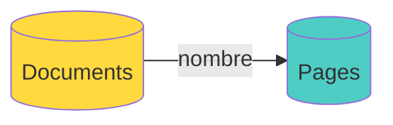

# 6.1 Colecciones MongoDB

## Colección: Documents

Metadatos de documentos PDF:

```json
{
  "_id": ObjectId("507f1f77bcf86cd799439011"),
  "nombre": "Reglamento de Pagos 2024",
  "tipo": "Ingeniería Informática",
  "descripcion": "Reglamento de pagos, matrículas y pensiones para estudiantes."
}
```

**Campos**:
- `_id`: ID único de MongoDB
- `nombre`: Nombre del documento
- `tipo`: Escuela o "Información General"
- `descripcion`: Resumen del contenido (usado por IA para selección)

---

## Colección: Pages (ScienceBot)

Páginas individuales con embeddings:

```json
{
  "_id": ObjectId("507f1f77bcf86cd799439012"),
  "nombre_archivo": "Reglamento de Pagos 2024",
  "pagina": 3,
  "text": "Artículo 15: El costo de matrícula para pregrado es de S/ 350 soles...",
  "embedding": [0.123, -0.456, 0.789, ... ] // 1536 dimensiones
}
```

**Campos**:
- `_id`: ID único
- `nombre_archivo`: Referencia al documento
- `pagina`: Número de página
- `text`: Contenido de texto
- `embedding`: Vector de 1536 dimensiones (OpenAI)

---

## Relación entre Colecciones



**Documents** contiene metadata.
**Pages** contiene contenido y embeddings.

La relación se hace por `nombre` (campo texto).

---

**Volver al índice**: [../README.md](../README.md)
