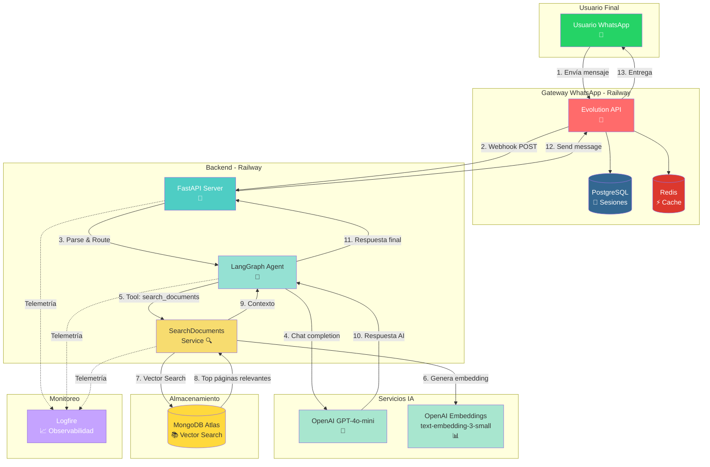
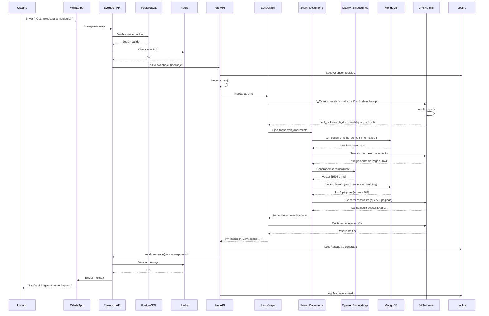
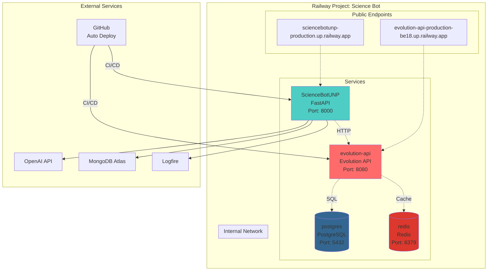

# 8.1 Arquitectura Completa del Sistema

## Diagrama de Arquitectura General



---

## Componentes del Sistema

### 1. Usuario Final
- **WhatsApp**: Interfaz de usuario
- **Dispositivo**: Móvil o web
- **Interacción**: Envío de mensajes de texto

### 2. Gateway WhatsApp (Evolution API)
- **Evolution API**: Gateway REST para WhatsApp
- **PostgreSQL**: Almacenamiento de sesiones y configuraciones
- **Redis**: Cache en memoria y cola de mensajes
- **Hosting**: Railway (Docker)

### 3. Backend (FastAPI + LangGraph)
- **FastAPI**: Framework web asíncrono
- **LangGraph Agent**: Orquestador conversacional
- **SearchDocuments Service**: Pipeline de búsqueda
- **Hosting**: Railway (Python)

### 4. Servicios de IA
- **OpenAI GPT-4o-mini**: Generación de respuestas
- **OpenAI Embeddings**: Vectorización de textos
- **API**: REST over HTTPS

### 5. Almacenamiento
- **MongoDB Atlas**: Base de datos NoSQL con Vector Search
- **Cloud**: MongoDB Cloud (multi-región)

### 6. Monitoreo
- **Logfire**: Observabilidad y telemetría
- **Cloud**: Pydantic Logfire

---

## Flujo de Datos Completo

### Paso 1-3: Recepción
```
Usuario → WhatsApp Servers → Evolution API → FastAPI Webhook
```

### Paso 4-5: Análisis
```
FastAPI → LangGraph Agent → OpenAI GPT-4o-mini
                         ↓
                   ¿Necesita buscar info?
                         ↓
              Tool: search_documents
```

### Paso 6-8: Búsqueda
```
SearchDocuments → OpenAI Embeddings → Vector [1536 dims]
                                          ↓
                                  MongoDB Vector Search
                                          ↓
                                  Top 5 páginas relevantes
```

### Paso 9-11: Generación
```
Páginas relevantes → LangGraph Agent → OpenAI GPT-4o-mini
                                            ↓
                                    Respuesta contextualizada
```

### Paso 12-13: Respuesta
```
LangGraph → FastAPI → Evolution API → WhatsApp → Usuario
```

---

## Diagrama de Secuencia Detallado



---

## Infraestructura en Railway



---

## Stack Tecnológico Completo

### Frontend
- WhatsApp (usuario final)

### Gateway
- Evolution API (WhatsApp Business API alternativo)
- Baileys (librería WhatsApp Web Protocol)

### Backend
- Python 3.12
- FastAPI (framework web)
- LangGraph (orquestador de agentes)
- LangChain (integraciones IA)
- Pydantic (validación de datos)

### IA
- OpenAI GPT-4o-mini (chat completion)
- OpenAI text-embedding-3-small (embeddings)

### Bases de Datos
- MongoDB Atlas (Vector Search)
- PostgreSQL (Evolution API)
- Redis (cache Evolution API)

### Deployment
- Railway (PaaS)
- Docker (containerización)
- GitHub Actions (CI/CD implícito)

### Monitoreo
- Logfire (observabilidad)
- Railway Dashboard (métricas)

---

## Patrones de Arquitectura

### 1. **Microservicios**
- Evolution API y FastAPI son servicios independientes
- Comunicación via HTTP REST
- Cada servicio con su base de datos

### 2. **Event-Driven**
- Webhooks de Evolution API
- Sistema reactivo a eventos de WhatsApp

### 3. **RAG (Retrieval-Augmented Generation)**
- Búsqueda vectorial en MongoDB
- Generación de respuestas con contexto

### 4. **Agent Pattern**
- LangGraph como orquestador
- Tools (search_documents)
- Decisiones dinámicas del LLM

---

## Escalabilidad

### Horizontal
- **FastAPI**: Múltiples réplicas en Railway
- **MongoDB**: Sharding automático en Atlas
- **Redis**: Cluster mode (si es necesario)

### Vertical
- **Railway**: Aumentar CPU/RAM por servicio
- **MongoDB Atlas**: Tier superior (M10, M20, etc.)

### Límites Actuales
- **Evolution API**: ~100 mensajes/minuto (rate limit WhatsApp)
- **OpenAI**: ~10,000 tokens/minuto (tier 1)
- **MongoDB**: ~100 queries/segundo (M0 tier)

---

## Seguridad

### Autenticación
- Evolution API: API Key en header
- OpenAI: API Key
- MongoDB: Usuario/password + whitelist IP

### Encriptación
- HTTPS en todos los endpoints
- TLS para conexiones a bases de datos
- Variables de entorno para secrets

### Privacidad
- No se almacenan mensajes de usuarios
- Solo metadata temporal en Redis
- MongoDB solo tiene documentos académicos públicos

---

## Próximos Pasos

- **[8.2 Flujo de Mensaje](./8.2-flujo-mensaje.md)**: Diagrama de secuencia detallado
- **[8.3 Grafo LangGraph](./8.3-grafo-langgraph.md)**: Visualización del agente

**Volver al índice**: [../README.md](../README.md)
