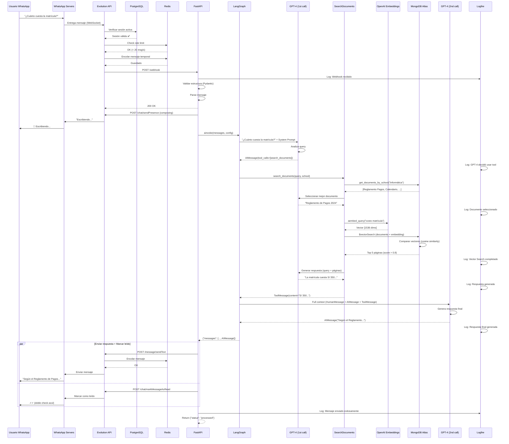

# 8.2 Flujo de Mensaje Completo

## Diagrama de Secuencia Detallado



---

## Tiempos de Ejecución

```
1. Usuario → WhatsApp → Evolution API: ~100ms
2. Evolution API (verificaciones): ~50ms
3. Webhook → FastAPI: ~20ms
4. FastAPI validación + parsing: ~10ms
5. Send presence (typing): ~100ms
6. LangGraph - chat (1st): ~800ms
   └─ GPT-4 tool call: ~750ms
7. LangGraph - tools: ~2500ms
   ├─ Get documents: ~50ms
   ├─ Select document: ~800ms
   ├─ Generate embedding: ~50ms
   ├─ Vector Search: ~100ms
   └─ Generate answer: ~1500ms
8. LangGraph - chat (2nd): ~900ms
   └─ GPT-4 final response: ~850ms
9. Send message + Mark as read: ~100ms

TOTAL: ~4.6 segundos (usuario ve respuesta)
```

---

## Eventos Críticos

### 1. Verificación de Sesión
```
Evolution API → PostgreSQL
Si falla → No se procesa el mensaje
```

### 2. Rate Limiting
```
Evolution API → Redis
Si excede → Mensaje rechazado
```

### 3. Webhook Recepción
```
Evolution API → FastAPI
Debe responder < 5 segundos
```

### 4. Vector Search
```
MongoDB Atlas
Performance crítica: ~100ms
```

### 5. OpenAI Calls
```
3 llamadas por consulta:
- Tool call decision: ~750ms
- Document selection: ~800ms
- Final response: ~850ms
```

---

## Puntos de Fallo

### 1. Evolution API Caído
```
Usuario → WhatsApp → ❌ Evolution API
Solución: Railway auto-restart
```

### 2. FastAPI Caído
```
Evolution API → ❌ FastAPI
Solución: Railway auto-restart + health checks
```

### 3. MongoDB Lento/Caído
```
SearchDocuments → ❌ MongoDB
Solución: Timeout + retry + error message al usuario
```

### 4. OpenAI Rate Limit
```
LangGraph → ❌ OpenAI (429 Too Many Requests)
Solución: Exponential backoff + queue
```

---

## Optimizaciones

### 1. Caché de Documentos
```python
# Cache lista de documentos por escuela
# Reduce ~50ms por consulta
```

### 2. Parallel Execution
```python
# Send message + Mark as read en paralelo
# Reduce ~100ms
```

### 3. Streaming
```python
# (Futuro) Stream respuesta de GPT-4
# Usuario ve respuesta progresivamente
```

---

## Observabilidad

Cada paso se registra en Logfire:

```
[WEBHOOK] Received: messages.upsert (instance: sciencebot)
[PARSE] Message from 51999999999: "¿Cuánto cuesta..."
[LANGGRAPH] Invoking agent
[GPT-4] Tool call: search_documents
[SEARCH] Get documents: Ingeniería Informática
[SEARCH] Selected: Reglamento de Pagos 2024
[SEARCH] Vector Search: 5 results (avg score: 0.89)
[GPT-4] Generated answer (tokens: 150)
[GPT-4] Final response (tokens: 100)
[EVOLUTION] Message sent successfully
[DONE] Total time: 4.6s
```

---

**Volver al índice**: [../README.md](../README.md)
