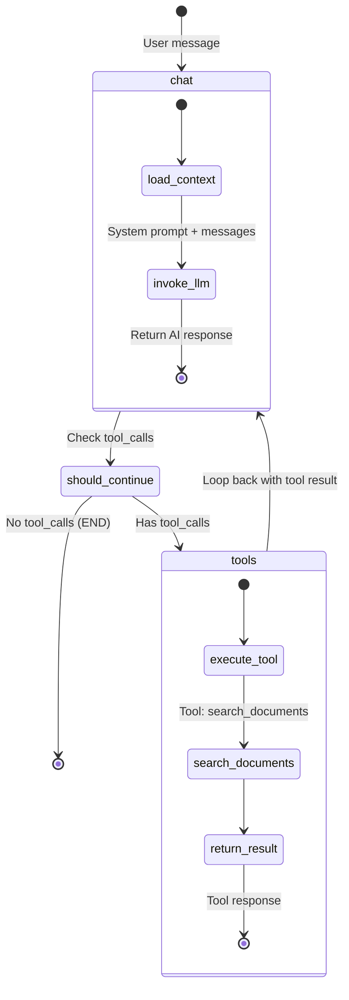
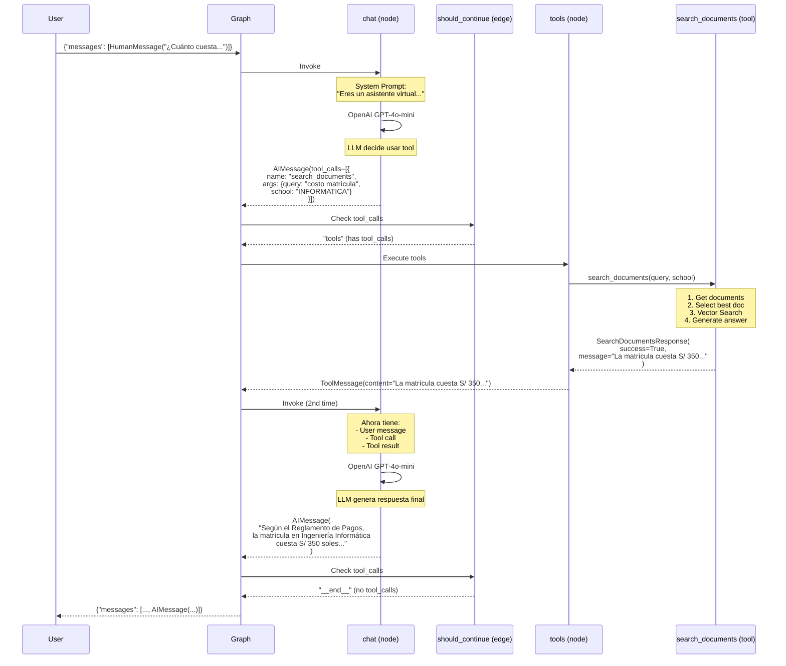
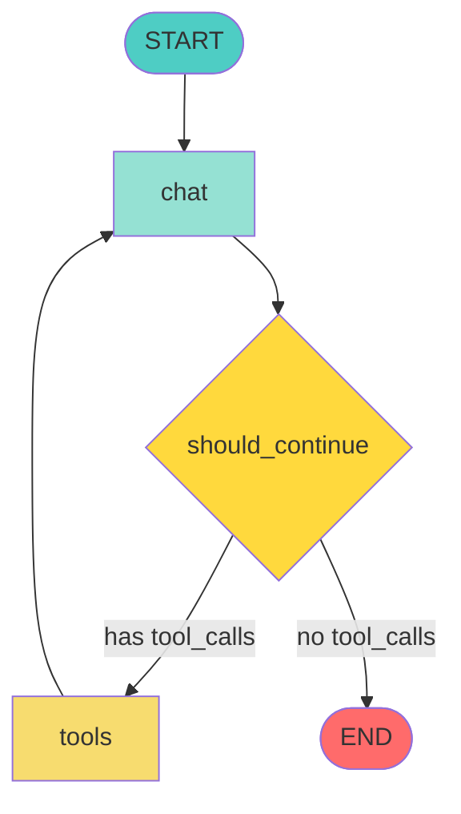

# 8.3 Grafo LangGraph del Agente

## Diagrama del Grafo Conversacional



---

## Componentes del Grafo

### 1. **Entry Point: chat**

El nodo `chat` es el punto de entrada del grafo:

```python
# app/science_bot/agent/graph.py

async def chat(state: InputState, config: RunnableConfig) -> dict:
    """Nodo principal que invoca OpenAI GPT-4o-mini con tools."""

    # 1. Obtener contexto (phone_number)
    context = Context.from_config(config)

    # 2. Configurar modelo
    model = ChatOpenAI(
        model=settings.OPENAI_MODEL,  # gpt-4o-mini
        api_key=SecretStr(settings.OPENAI_API_KEY),
        max_completion_tokens=settings.OPENAI_MAX_TOKENS,
        temperature=settings.OPENAI_TEMPERATURE,
    )

    # 3. Bind tools
    model_with_tools = model.bind_tools(tools=TOOLS, strict=True)

    # 4. System prompt
    prompt = ChatPromptTemplate.from_messages([
        ("system", get_system_prompt(phone_number=context.phone_number)),
        MessagesPlaceholder(variable_name="messages"),
    ])

    # 5. Invocar
    response = await (prompt | model_with_tools).ainvoke(
        input={"messages": state.messages}
    )

    return {"messages": [response]}
```

**Responsabilidades**:
- Cargar contexto del usuario
- Configurar modelo con tools
- Generar system prompt
- Invocar OpenAI
- Retornar respuesta

---

### 2. **Conditional Edge: should_continue**

Decide si continuar con herramientas o finalizar:

```python
async def should_continue(state: OverallState) -> Literal["tools", "__end__"]:
    """Verifica si el LLM pidió usar alguna herramienta."""
    messages = state.messages
    last_message = messages[-1]

    if last_message.tool_calls:  # ¿Tiene llamadas a tools?
        return "tools"           # → Ir a nodo "tools"

    return "__end__"             # → Finalizar grafo
```

**Lógica**:
- Si `last_message.tool_calls` existe → ejecutar herramientas
- Si no → respuesta final, terminar

---

### 3. **Tool Node: tools**

Ejecuta las herramientas solicitadas:

```python
from langgraph.prebuilt import ToolNode

# ToolNode ejecuta automáticamente las tools
graph_builder.add_node(node="tools", action=ToolNode(tools=TOOLS))
```

**ToolNode hace**:
1. Lee `tool_calls` del mensaje anterior
2. Encuentra la función correspondiente (search_documents)
3. Extrae argumentos (query, school)
4. Ejecuta la función async
5. Retorna resultado como ToolMessage

---

### 4. **Edge: tools → chat**

Después de ejecutar tools, vuelve a `chat`:

```python
graph_builder.add_edge(start_key="tools", end_key="chat")
```

**Flujo**:
```
chat → tools → chat → __end__
```

El segundo `chat` recibe:
- Mensaje original del usuario
- Respuesta AI con tool_calls
- Resultado de search_documents

Y genera la respuesta final usando ese contexto.

---

## Flujo Completo: Ejemplo Real

### Ejemplo: "¿Cuánto cuesta la matrícula en Informática?"



---

## Estado del Grafo (State)

### InputState

```python
class InputState(BaseModel):
    messages: list[BaseMessage]

# Ejemplo:
{
  "messages": [
    HumanMessage(content="¿Cuánto cuesta la matrícula?")
  ]
}
```

### OverallState (durante ejecución)

```python
class OverallState(BaseModel):
    messages: list[BaseMessage]

# Después del 1er chat:
{
  "messages": [
    HumanMessage(content="¿Cuánto cuesta la matrícula?"),
    AIMessage(
      content="",
      tool_calls=[{
        "name": "search_documents",
        "args": {"query": "costo matrícula", "school": "INFORMATICA"}
      }]
    )
  ]
}

# Después de tools:
{
  "messages": [
    HumanMessage(content="¿Cuánto cuesta la matrícula?"),
    AIMessage(content="", tool_calls=[...]),
    ToolMessage(content="La matrícula cuesta S/ 350...", tool_call_id="...")
  ]
}

# Después del 2do chat:
{
  "messages": [
    HumanMessage(content="¿Cuánto cuesta la matrícula?"),
    AIMessage(content="", tool_calls=[...]),
    ToolMessage(content="La matrícula cuesta S/ 350..."),
    AIMessage(content="Según el Reglamento de Pagos, la matrícula cuesta S/ 350 soles.")
  ]
}
```

---

## Context (Información Adicional)

```python
class Context(BaseModel):
    phone_number: str

    @classmethod
    def from_config(cls, config: RunnableConfig) -> "Context":
        return cls(phone_number=config.get("phone_number", "unknown"))
```

**Uso**:
```python
# Al invocar el grafo
response = await graph.ainvoke(
    input={"messages": [HumanMessage("Hola")]},
    config={"phone_number": "51999999999"}  # ⭐ Context
)
```

El contexto está disponible en el nodo `chat`:
```python
async def chat(state: InputState, config: RunnableConfig):
    context = Context.from_config(config)
    print(context.phone_number)  # "51999999999"
```

---

## Configuración del Grafo

```python
# app/science_bot/agent/graph.py

from langgraph.graph import StateGraph

# 1. Crear grafo
graph_builder = StateGraph(
    state_schema=OverallState,
    input_schema=InputState,
    output_schema=OutputState,
    context_schema=Context,
)

# 2. Agregar nodos
graph_builder.add_node(node="chat", action=chat)
graph_builder.add_node(node="tools", action=ToolNode(tools=TOOLS))

# 3. Set entry point
graph_builder.set_entry_point("chat")

# 4. Agregar edges
graph_builder.add_conditional_edges(
    source="chat",
    path=should_continue,
    path_map=["tools", "__end__"]
)
graph_builder.add_edge(start_key="tools", end_key="chat")

# 5. Compilar
graph = graph_builder.compile()
```

---

## Visualización del Grafo (Mermaid)



---

## Tipos de Mensajes (LangChain)

### HumanMessage
```python
HumanMessage(content="¿Cuánto cuesta la matrícula?")
```

### AIMessage
```python
# Sin tool calls
AIMessage(content="Hola, soy ScienceBot")

# Con tool calls
AIMessage(
    content="",
    tool_calls=[{
        "name": "search_documents",
        "args": {"query": "...", "school": "..."}
    }]
)
```

### ToolMessage
```python
ToolMessage(
    content="La matrícula cuesta S/ 350...",
    tool_call_id="call_abc123"
)
```

---

## Herramientas Disponibles

### search_documents

```python
@tool
async def search_documents(
    query: str,
    school: SchoolEnum,
) -> SearchDocumentsResponse:
    """
    Busca información en documentos académicos de la UNP.

    Args:
        query: Pregunta del usuario
        school: Escuela específica (49 opciones)

    Returns:
        Respuesta generada con contexto
    """
    # Pipeline completo:
    # 1. Get documents by school
    # 2. Select best document (AI)
    # 3. Vector Search in document
    # 4. Generate answer (AI)
```

---

## Limitaciones del Grafo Actual

1. **Sin memoria persistente**: Cada invocación es independiente
2. **Un solo ciclo**: No permite múltiples iteraciones de tools
3. **Una sola tool**: Solo search_documents disponible
4. **Sin branching complejo**: Flujo lineal

---

## Mejoras Futuras

### 1. **Memoria Conversacional**

```python
from langgraph.checkpoint.postgres import PostgresSaver

checkpointer = PostgresSaver(conn_string="postgresql://...")
graph = graph_builder.compile(checkpointer=checkpointer)

# Ahora recuerda conversaciones previas
```

### 2. **Múltiples Herramientas**

```python
TOOLS = [
    search_documents,
    calculate_cost,        # Nueva tool
    check_requirements,    # Nueva tool
]
```

### 3. **Human-in-the-Loop**

```python
graph_builder.add_node(node="human_approval", action=wait_for_approval)

# Pedir confirmación antes de ejecutar actions
```

### 4. **Branching Complejo**

```python
def route_by_intent(state):
    intent = classify_intent(state.messages[-1])
    if intent == "administrative":
        return "admin_flow"
    elif intent == "academic":
        return "academic_flow"
    return "general_flow"

graph_builder.add_conditional_edges(
    source="classify",
    path=route_by_intent,
    path_map=["admin_flow", "academic_flow", "general_flow"]
)
```

---

## Debugging del Grafo

### 1. **Modo Desarrollo**

```bash
uv run langgraph dev --allow-blocking
# Abre UI en http://localhost:8123
```

### 2. **Logs**

```python
# En cada nodo
async def chat(state):
    print(f"[CHAT] Received: {state.messages}")
    response = await llm.ainvoke(...)
    print(f"[CHAT] Response: {response}")
    return {"messages": [response]}
```

### 3. **Streaming**

```python
# Ver cada paso
async for event in graph.astream(input={...}):
    print(event)
```

---

## Recursos Adicionales

- [LangGraph Docs](https://langchain-ai.github.io/langgraph/)
- [LangGraph Examples](https://github.com/langchain-ai/langgraph/tree/main/examples)
- [LangGraph Studio](https://github.com/langchain-ai/langgraph-studio)

---

## Próximos Pasos

- **[5.1 Estructura del Grafo](../5-modelo-agente/5.1-estructura-grafo.md)**: Análisis profundo del código
- **[5.2 Herramientas](../5-modelo-agente/5.2-herramientas.md)**: Tools y binding

**Volver al índice**: [../README.md](../README.md)
