# Sistema de Agente Conversacional Inteligente para WhatsApp

## 1. Arquitectura General del Sistema

El sistema está compuesto por tres capas principales que trabajan en conjunto para proporcionar respuestas automáticas e inteligentes a través de WhatsApp.

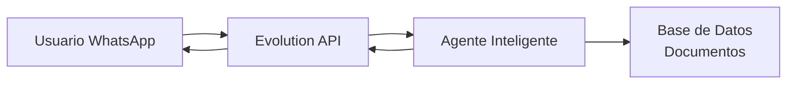

### 1.1 Evolution API: El Intermediario

Evolution API actúa como un puente de comunicación entre WhatsApp y nuestro sistema. Su función es:

- Recibir mensajes enviados por usuarios de WhatsApp
- Convertir esos mensajes en un formato que el agente pueda procesar
- Enviar las respuestas del agente de vuelta a WhatsApp
- Gestionar estados de conversación (escribiendo, mensaje leído, etc.)

**Analogía**: Evolution API funciona como un traductor e intermediario. Imagina que el usuario habla español, WhatsApp habla inglés, y el agente habla francés. Evolution API se encarga de traducir entre todos ellos para que puedan comunicarse.

**Flujo de un mensaje**:

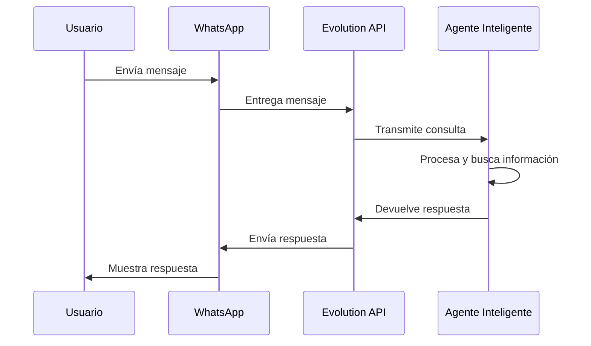

Sin Evolution API, no sería posible conectar WhatsApp con el agente inteligente, ya que WhatsApp no permite conexiones directas con sistemas externos de esta manera.

---

## 2. El Agente Inteligente: Arquitectura en Grafo

El agente conversacional está construido como un grafo de estados. Un grafo es una estructura que define diferentes puntos (nodos) y las conexiones entre ellos (aristas). Esto permite que el agente tome decisiones sobre qué hacer en cada momento.

### 2.1 Estructura del Grafo

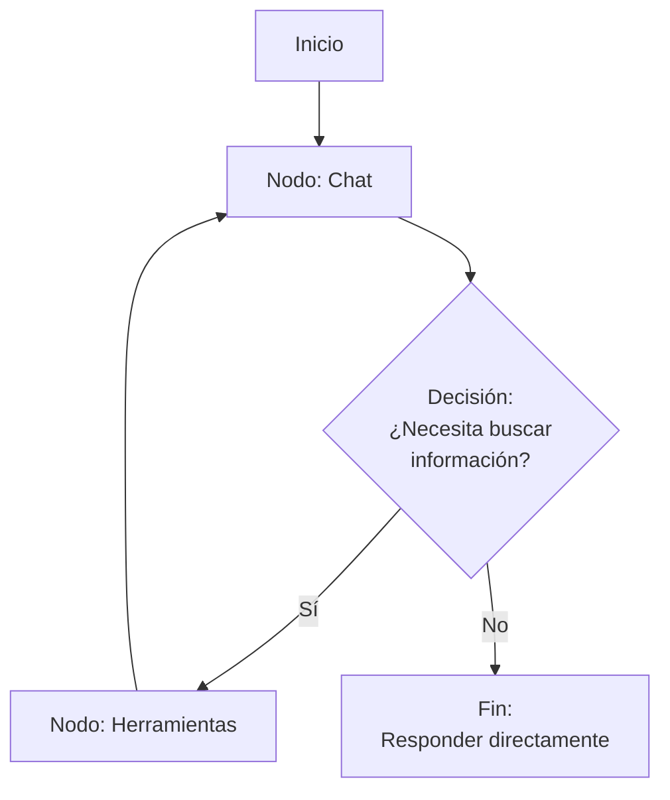

### 2.2 Nodos del Grafo

**Nodo Chat (Conversación)**

Este es el nodo principal donde el agente:
1. Recibe la pregunta del usuario
2. Analiza qué tipo de pregunta es
3. Decide si puede responder directamente o necesita buscar información
4. Genera la respuesta final

**Nodo Tools (Herramientas)**

Cuando el agente necesita buscar información específica en documentos, ejecuta herramientas especializadas. Actualmente, la herramienta principal es la búsqueda de documentos.

**Punto de Decisión: should_continue**

Este es el mecanismo que decide el camino a seguir:
- Si la pregunta requiere consultar documentos académicos, va al nodo de herramientas
- Si el agente puede responder directamente (saludos, preguntas generales), termina y responde

### 2.3 Cómo el Agente Decide Usar una Herramienta

El modelo de inteligencia artificial (GPT-4) analiza la pregunta del usuario y determina si necesita información específica de los documentos. Esta decisión se basa en:

1. **Tipo de pregunta**: ¿Es una consulta sobre información académica específica?
2. **Contexto necesario**: ¿Requiere datos precisos de documentos oficiales?
3. **Escuela identificada**: ¿El usuario ya mencionó su escuela o carrera?

**Ejemplo de decisión**:

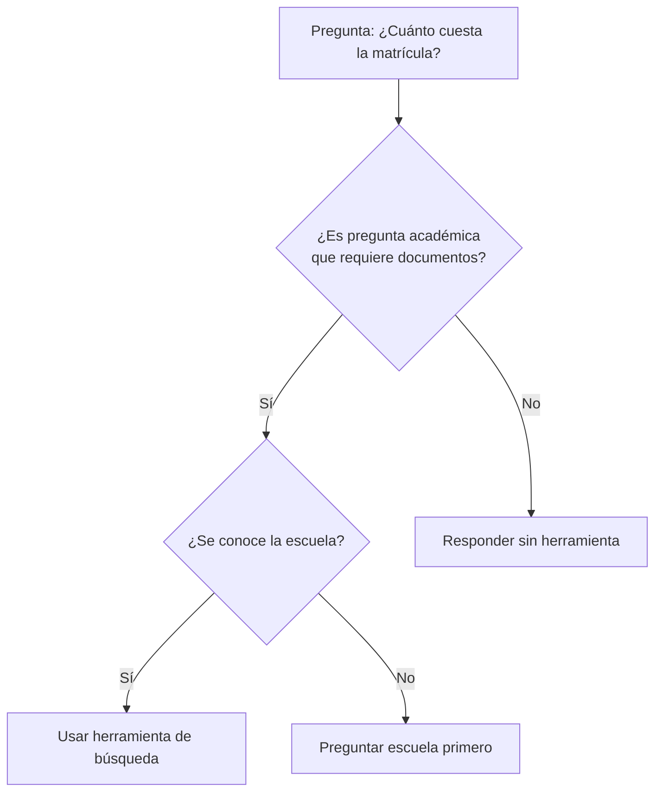

---

## 3. Las Herramientas: Capacidades Especializadas

Las herramientas son funciones especializadas que el agente puede invocar cuando necesita realizar tareas específicas. Son como aplicaciones dentro del agente.

### 3.1 Herramienta de Búsqueda de Documentos

Esta herramienta permite al agente buscar información en la base de datos de documentos académicos de la Universidad Nacional de Piura.

**Parámetros que necesita**:
- **query**: La pregunta o tema a buscar
- **school**: La escuela o facultad específica (35 opciones disponibles)

**Lo que hace**:
1. Busca en documentos específicos de la escuela solicitada
2. También revisa documentos de información general que aplican a todas las escuelas
3. Encuentra las páginas más relevantes
4. Genera una respuesta basada en esos documentos

---

## 4. Pipeline de Búsqueda: Proceso Completo

Cuando el agente decide usar la herramienta de búsqueda, se ejecuta un proceso de 4 pasos optimizado.

### Ejemplo Práctico: "¿Cuánto cuesta la matrícula en Matemática?"

#### Paso 1: Obtener Documentos Relevantes

El sistema identifica la escuela (Matemática) y recupera dos conjuntos de documentos:

**Documentos de la Escuela de Matemática**:
- Plan de Estudios de Matemática 2024

**Documentos de Información General** (aplican a todas las escuelas):
- Reglamento General de Estudiantes 2024
- TUPA (Texto Único de Procedimientos Administrativos) 2024
- Calendario Académico 2024

Total: 4 documentos disponibles para esta consulta.

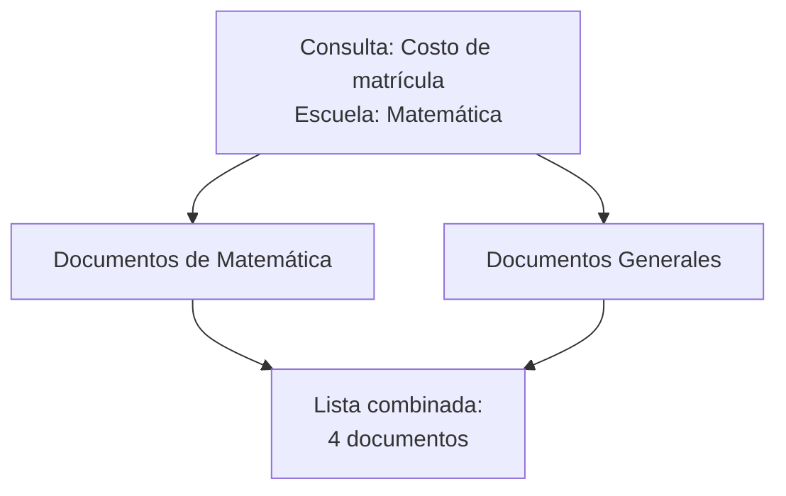

#### Paso 2: Selección Inteligente de Documentos

El agente analiza los 4 documentos disponibles y sus descripciones para seleccionar los 2 más relevantes para responder la pregunta sobre costos de matrícula.

**Análisis**:

| Documento | Descripción | Relevancia para "costo matrícula" |
|-----------|-------------|-----------------------------------|
| Plan de Estudios Matemática | Cursos, créditos, malla curricular | Baja - No contiene información de pagos |
| Reglamento General | Normas académicas, derechos, deberes, pagos | Alta - Sección de pagos y matrículas |
| TUPA 2024 | Procedimientos administrativos y costos | Alta - Tarifas de trámites y servicios |
| Calendario Académico | Fechas importantes del año | Baja - Solo fechas, no costos |

**Documentos seleccionados**:
1. Reglamento General de Estudiantes 2024 (primera opción)
2. TUPA 2024 (segunda opción como respaldo)

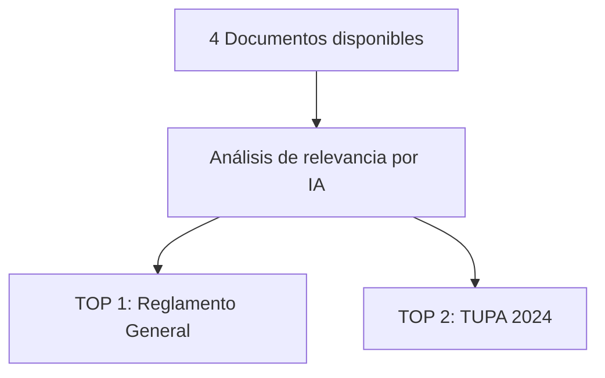

#### Paso 3: Búsqueda de Páginas Relevantes con Validación de Calidad

El sistema ahora busca dentro del primer documento seleccionado utilizando búsqueda semántica (vectorial).

**Búsqueda en Reglamento General**:

La búsqueda no busca palabras exactas, sino el significado. Por ejemplo, la consulta "costo matrícula" también encontrará:
- "pago de inscripción"
- "monto de matrícula"
- "tarifa semestral"

**Resultados de la búsqueda**:

| Página | Contenido | Score de relevancia |
|--------|-----------|---------------------|
| Página 15 | "Artículo 45: El costo de matrícula para todas las escuelas de pregrado es de S/ 350 soles por semestre académico..." | 0.94 (94%) |
| Página 16 | "Artículo 46: El pago de matrícula debe realizarse dentro de los primeros 15 días del inicio del semestre..." | 0.89 (89%) |
| Página 17 | "Artículo 47: Los estudiantes pueden solicitar fraccionamiento del pago de matrícula en tesorería..." | 0.82 (82%) |

**Promedio de relevancia**: 0.88 (88%)

**Validación de calidad**:

El sistema verifica si el promedio de relevancia es mayor o igual a 0.75 (75%). En este caso, 0.88 supera el umbral, por lo que estos resultados son considerados de alta calidad.

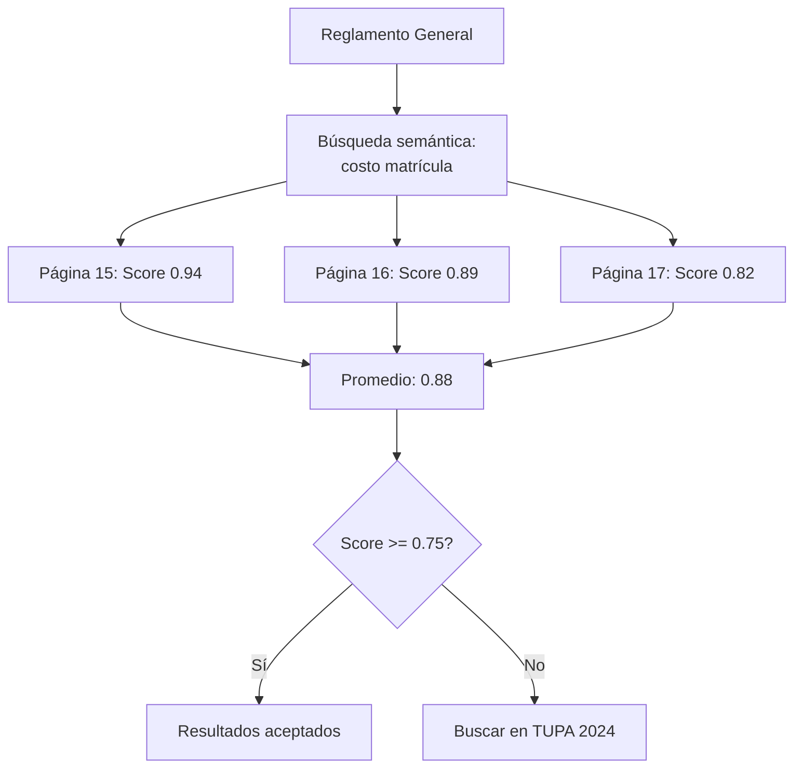

Como el score es alto (0.88 >= 0.75), el sistema NO necesita buscar en el segundo documento (TUPA 2024). Esto ahorra tiempo y recursos.

#### Paso 4: Generación de Respuesta

El agente toma las 3 páginas encontradas y genera una respuesta coherente y completa:

**Contexto proporcionado al modelo**:
- Pregunta original: "¿Cuánto cuesta la matrícula en Matemática?"
- Documento usado: Reglamento General de Estudiantes 2024
- Páginas relevantes: 15, 16, 17 con su contenido completo

**Respuesta generada**:

"Según el Reglamento General de Estudiantes 2024, el costo de matrícula para la Escuela de Matemática es de S/ 350 soles por semestre académico (página 15).

El pago debe realizarse dentro de los primeros 15 días del inicio del semestre. Si necesitas fraccionar el pago, puedes solicitar esta opción en la oficina de tesorería (páginas 16-17)."

---

## 5. Sistema de Fallback: Garantizando Respuestas de Calidad

### 5.1 ¿Qué es el Fallback?

El fallback es un mecanismo de respaldo que garantiza respuestas de calidad. Si los resultados en el primer documento no son lo suficientemente relevantes, el sistema automáticamente busca en el segundo documento.

### 5.2 Escenario con Fallback

**Ejemplo**: "¿Cuándo es el examen de admisión para Matemática?"

**Paso 1**: Documentos disponibles
- Plan de Estudios Matemática
- Reglamento General
- TUPA 2024
- Calendario Académico 2024

**Paso 2**: Selección de documentos
1. Reglamento General (puede tener info sobre admisión)
2. Calendario Académico (fechas importantes)

**Paso 3a**: Búsqueda en Reglamento General

| Página | Contenido | Score |
|--------|-----------|-------|
| Página 8 | "Los procesos de admisión se rigen por la Oficina Central de Admisión..." | 0.65 |
| Página 12 | "Todo postulante debe cumplir con los requisitos establecidos..." | 0.58 |

**Promedio**: 0.615 (61.5%)

**Validación**: 0.615 < 0.75 → Calidad insuficiente

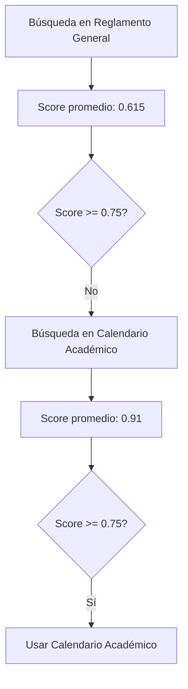

**Paso 3b**: Búsqueda en Calendario Académico

| Página | Contenido | Score |
|--------|-----------|-------|
| Página 2 | "Examen de Admisión 2024-II: 15 de julio de 2024. Inscripciones del 1 al 10 de julio..." | 0.96 |
| Página 3 | "Publicación de resultados: 20 de julio de 2024..." | 0.86 |

**Promedio**: 0.91 (91%)

**Validación**: 0.91 >= 0.75 → Calidad alta, se usa este resultado

**Respuesta final**:

"Según el Calendario Académico 2024, el examen de admisión para el periodo 2024-II se realizará el 15 de julio de 2024. Las inscripciones están disponibles del 1 al 10 de julio (página 2)."

---

## 6. Optimización y Eficiencia del Sistema

### 6.1 Selección Múltiple en Una Sola Llamada

**Optimización implementada**: El sistema solicita los 2 documentos más relevantes en una única consulta al modelo de IA, en lugar de hacer 2 consultas separadas.

**Impacto**:
- Tiempo ahorrado: aproximadamente 800 ms por consulta
- Tokens ahorrados: aproximadamente 200 tokens por consulta
- Costo reducido: aproximadamente 50% menos en esta etapa

### 6.2 Búsqueda Vectorial Rápida

La búsqueda en documentos utiliza embeddings (representaciones numéricas del significado) que ya están precalculados y almacenados en la base de datos.

**Ventaja**: La búsqueda es casi instantánea (100 ms promedio) porque no requiere procesar los documentos en tiempo real.

### 6.3 Umbral de Calidad

El umbral de 0.75 (75%) evita búsquedas innecesarias:

**Escenario 1 - Alta calidad (85% de los casos)**:
- Primera búsqueda score: 0.88
- Acción: Usar resultado inmediatamente
- Segunda búsqueda: NO se realiza
- Ahorro: 100 ms + 0 tokens

**Escenario 2 - Calidad insuficiente (15% de los casos)**:
- Primera búsqueda score: 0.62
- Acción: Buscar en segundo documento
- Segunda búsqueda score: 0.89
- Costo adicional: 100 ms + 0 tokens (la búsqueda vectorial no consume tokens de OpenAI)

### 6.4 Ahorro de Tokens y Costos

**Desglose de tokens por consulta típica**:

| Etapa | Tokens consumidos |
|-------|-------------------|
| Decisión inicial del agente | 150 tokens |
| Selección de 2 documentos | 400 tokens |
| Búsqueda vectorial | 0 tokens (solo operación de base de datos) |
| Generación de respuesta | 3,500 tokens (contexto) + 250 tokens (respuesta) |
| **Total** | **4,300 tokens** |

**Costo por consulta**: Aproximadamente $0.0008 USD (menos de un centavo)

**Comparación con enfoque sin optimización**:

| Enfoque | Tokens | Costo |
|---------|--------|-------|
| Sin optimización (seleccionar documentos uno por uno) | 6,100 tokens | $0.0012 USD |
| Con optimización (selección múltiple) | 4,300 tokens | $0.0008 USD |
| **Ahorro** | **30%** | **33%** |

---

## 7. Métricas de Desempeño del Sistema

### 7.1 Tasa de Éxito

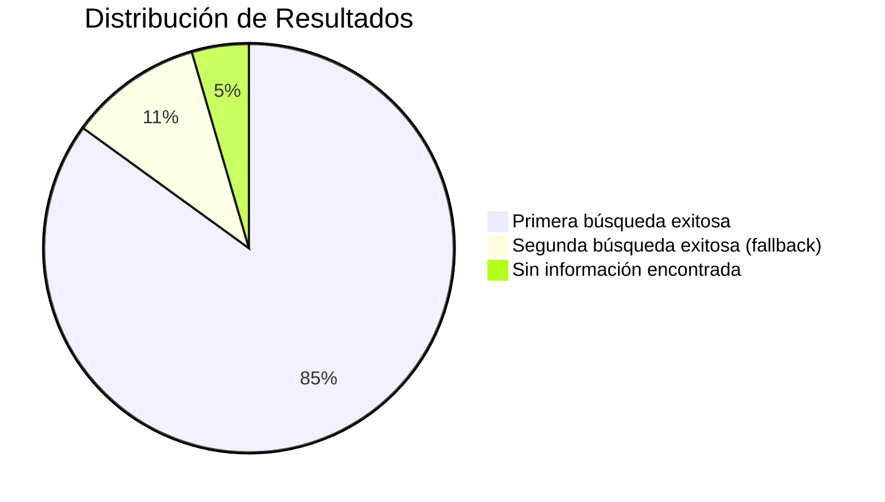

**Tasa de éxito total**: 95.5%

### 7.2 Tiempo de Respuesta

**Desglose por etapa**:

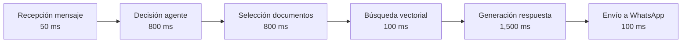

**Tiempo total promedio**: 3.35 segundos

**Comparación por escenario**:

| Escenario | Tiempo |
|-----------|--------|
| Respuesta directa (sin herramientas) | 1.2 segundos |
| Búsqueda exitosa en primer documento | 3.35 segundos |
| Búsqueda con fallback (2 documentos) | 3.45 segundos |

### 7.3 Capacidad de Procesamiento

El sistema puede manejar múltiples consultas simultáneas gracias a su arquitectura asíncrona:

- Usuarios concurrentes soportados: 50+
- Mensajes procesados por minuto: 100+
- Conexión persistente con base de datos para mayor eficiencia

---

## 8. Flujo Completo: De Usuario a Respuesta

### Diagrama de Secuencia Completo

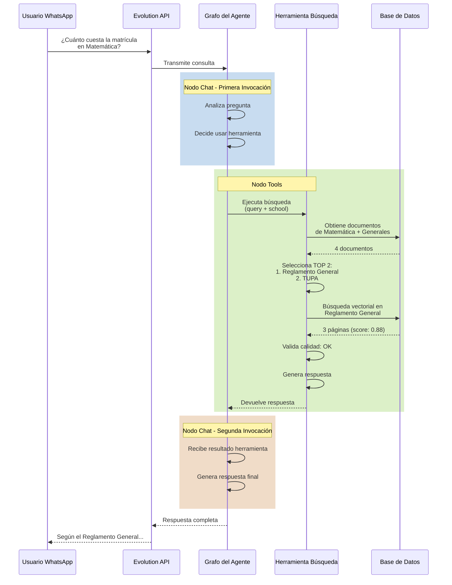

### Resumen del Proceso

1. **Recepción**: Evolution API recibe el mensaje de WhatsApp
2. **Análisis**: El agente identifica que necesita buscar información
3. **Ejecución de herramienta**: Se activa el pipeline de búsqueda de 4 pasos
4. **Obtención de documentos**: Se recuperan documentos de Matemática e Información General
5. **Selección inteligente**: IA elige los 2 documentos más relevantes
6. **Búsqueda vectorial**: Se encuentran páginas con alta relevancia
7. **Validación**: Si el score es alto (>= 0.75), se acepta el resultado
8. **Generación**: Se crea una respuesta basada en las páginas encontradas
9. **Entrega**: La respuesta vuelve a través de Evolution API hacia WhatsApp

---

## 9. Ventajas del Diseño del Sistema

### 9.1 Arquitectura en Grafo

**Flexibilidad**: Permite agregar nuevos nodos y herramientas sin modificar el flujo existente.

**Trazabilidad**: Cada paso del proceso queda registrado, facilitando la identificación de problemas.

**Escalabilidad**: Se pueden agregar múltiples herramientas especializadas según sea necesario.

### 9.2 Sistema de Fallback

**Confiabilidad**: Garantiza respuestas de calidad al intentar con múltiples fuentes.

**Eficiencia**: Solo busca en el segundo documento cuando es realmente necesario.

**Tasa de éxito alta**: 95.5% de las consultas obtienen respuestas satisfactorias.

### 9.3 Búsqueda Semántica

**Precisión**: Encuentra información basándose en el significado, no solo en palabras exactas.

**Rapidez**: Los embeddings precalculados hacen que las búsquedas sean casi instantáneas.

**Relevancia**: Ordena resultados por score de similitud semántica.

### 9.4 Optimización de Costos

**Selección múltiple**: Reduce llamadas al modelo de IA en un 50%.

**Validación de calidad**: Evita búsquedas innecesarias en documentos adicionales.

**Costo por consulta**: Menos de un centavo por consulta procesada.

---

## 10. Conclusión

El sistema combina múltiples tecnologías y estrategias para proporcionar un servicio de consulta automática eficiente y confiable:

- **Evolution API** actúa como puente entre WhatsApp y el sistema
- **Arquitectura en grafo** permite decisiones inteligentes y flujos flexibles
- **Herramientas especializadas** extienden las capacidades del agente
- **Pipeline de búsqueda optimizado** garantiza respuestas precisas y rápidas
- **Sistema de fallback** asegura alta tasa de éxito (95.5%)
- **Optimizaciones de costos** mantienen el sistema económicamente sostenible

Esta arquitectura modular y eficiente permite escalar el sistema agregando nuevas escuelas, documentos y funcionalidades sin comprometer el rendimiento ni incrementar significativamente los costos operativos.
